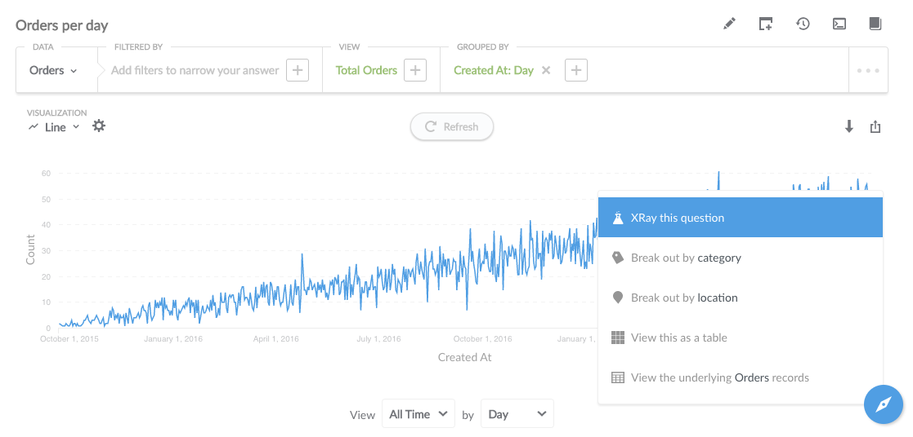
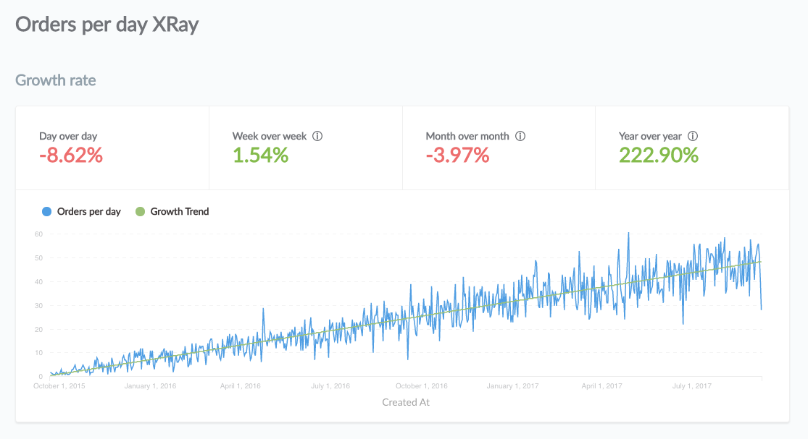
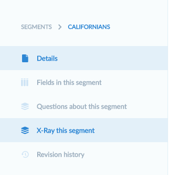
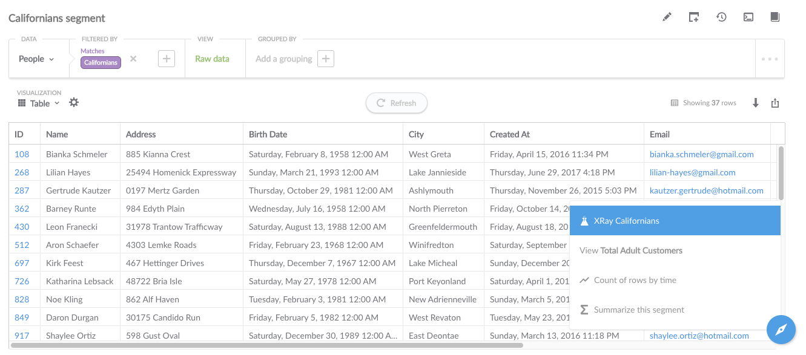
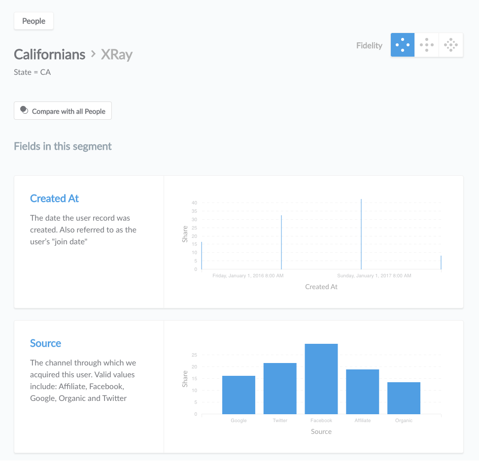
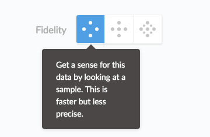
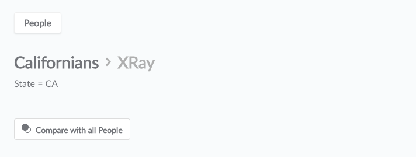
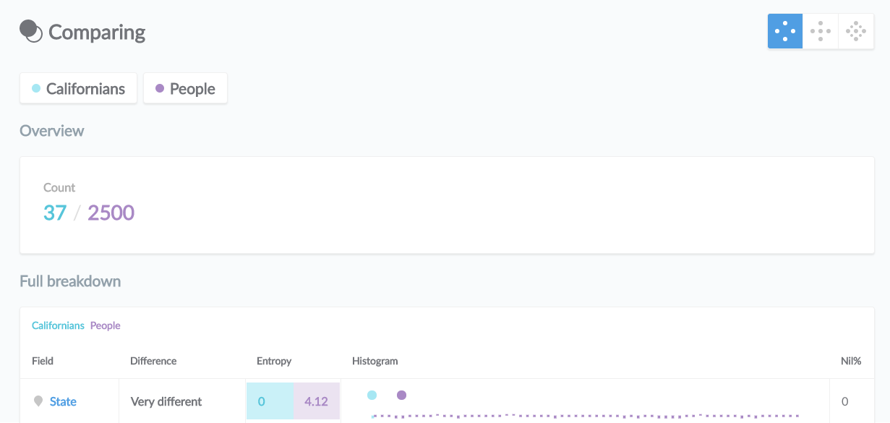

## X-rays and Comparisons
---
X-rays and comparisons are two powerful new features in Metabase that allow you to get deeper statistical reports about your segments, fields, and time series.

### Time series x-rays

To view an x-ray report for a time series, open up a saved time series question (any kind of chart or table with a metric broken out by time), click on the Action Menu in the bottom-right of the screen, and select "X-ray this question:"

You'll get an in-depth analysis of your time series question, including growth rates, the distribution of values, and seasonality:

### Segment, table, and field x-rays
To view an x-ray for a segment, table, or field, first go to the Data Reference, then navigate to the thing you want to x-ray, then select the x-ray option in the lefthand menu:

If you have a saved Raw Data question that uses one or more segments as filters, you can also x-ray one of those segments from the Action Menu in the bottom-right of the screen when viewing that question:

An x-ray report for a segment called "Californians" looks like this, displaying a summary of the distribution of values for each field in the segment, and the maximal and minimal values if applicable:

Clicking on the summary for any field will take you to the detailed x-ray report for that single field.

### Changing the fidelity of an x-ray

X-rays can be a somewhat costly or slow operation for your database to run, so by default Metabase only does a quick sampling of the segment or field you're x-raying. You can increase the fidelity in the top-right of the x-ray page:

Administrators can also set the maximum allowed fidelity for x-rays in the Admin Panel. Note that the `Extended` setting is required for time series x-rays to work. Admins can even turn x-rays off entirely, but that makes Simon cry. No one likes it when Simon cries.

### Comparing segments

Segments are a subset of a larger table or list, so one thing you can do when viewing an x-ray of a segment is compare it to its "parent" table. For example, if I have a segment called "Californians," which is a subset of the "People" table, I can click on the button that says "Compare to all People" to see a comparison report:

The comparison report shows how many rows there are in the segment versus the parent table, and also gives you a breakdown of how the fields in the segment differ from that of the parent table:

An example for where this can be especially useful is a scenario where you've defined many different segments for your users or customers, like "Repeat Customers," "Users between 18 and 35," or "Female customers in Kalamazoo who dislike cheese." You can open up the x-ray for any of these segments, and then compare them to the larger Users or Customers table to see if there are any interesting patterns or differences.

## Automated insights
Metabase hasn't quite achieved self-awareness, but it has gotten smarter recently. It will now show you relevant insights about your data at the top of time series or x-rays or x-rays on numeric fields, provided there's something insightful to say. Here's some of the things Metabase might point out to you:

- The normal range of values in your data.
- Whether or not there seem to be a lot of missing values or zeros in your data.
- Whether or not your data has an overall trend, and if so, what kind of trend.
- Whether or not your data can be broken up into different distinct stages of growth or decline.
- Whether or not your data is stationary.
- Whether or not your data has a strong or mild autocorrelation [@sb, I don't totally understand this one. Something to do with lagged repeating patterns?]
- Whether the range of variation in your data is contracting or expanding.
- Whether or not your data contains uncharacteristic spikes or valleys, and if so, where.
- Whether or not there seem to be structural breaks in your data. [@sb, don't know what this one means either]
- Whether or not your data is noisy.
- Whether or not your data has a seasonal component, meaning that it tends to follow a similar shape at regular intervals.
- Whether or not your data seems to be multi-modal, with two or more distinct sections that are very different from each other.

## Need help?
If you still have questions about x-rays or comparisons, you can head over to our [discussion forum](http://discourse.metabase.com/). See you there!
