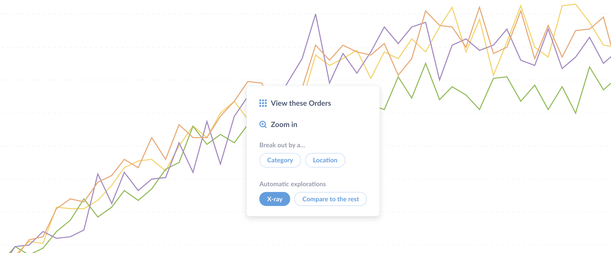
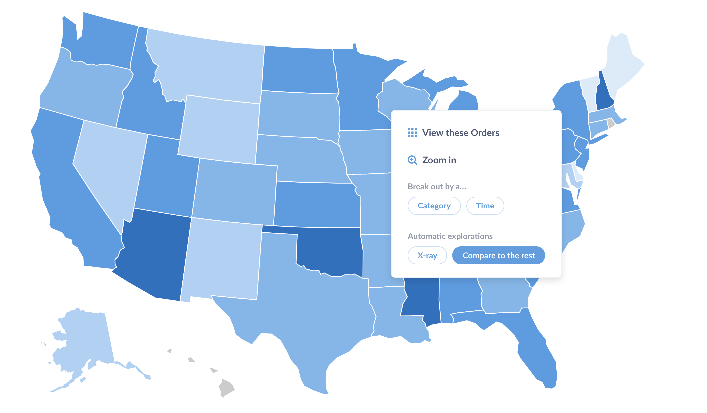
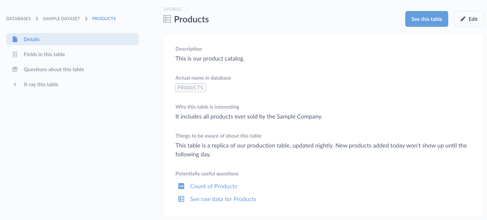

## X-rays
---
X-rays are a fast and easy way to get automatic insights and explorations of your data.

### Viewing x-rays by clicking on charts or tables

One great way to explore your data in general in Metabase is to click on points of interest in charts or tables, which shows you ways to further explore that point. We've added x-rays to this action menu, so if you for example find a point on your line chart that seems extra interesting, give it a click and x-ray it! We think you'll like what you see.

### Comparisons

When you click on a bar or point on a chart, you can now also choose the Compare action from the menu that pops up to see how the thing you've clicked on compares to the rest of the data.

If you're already looking at an x-ray of a table or a segment, Metabase will also give you the option to compare the current table or segment to other segments of the table, if there are any. This is a very fast, powerful way to see, for example, how different segments of your users or orders compare to each other.

### Table x-rays

Another great way to get to know your data is by x-raying your tables. From the home page, scroll to the bottom of the screen, click on one of your connected databases, and then click the bolt icon on a table to view an x-ray of it.

### X-raying question results

You can also see an x-ray of the results of a saved or unsaved question by clicking the blue compass button in the bottom-right of the question screen and selecting the x-ray action. This will show you an x-ray of the numbers and fields in your question's results.

## X-rays in the Data Reference

You can also view an x-ray by navigating to a table, field, metric, or segment in the [Data Reference](./12-data-model-reference.md). Just click the x-ray link in the lefthand sidebar.

### Browsing through x-rays

One fun and interesting thing you can do once you're looking at an x-ray is to click and browse through the list of suggested next x-rays that show up in the righthand column.

Depending on the x-ray you're currently viewing, you'll see suggestions that will let you:

- compare the table or segment you're currently x-raying to another segment
- "zoom out" and view an x-ray of the table the current x-ray is based on
- "zoom in" to see a more detailed x-ray about a field or dimension of the current x-ray
- go to an x-ray of a related item, like a metric based on the current table, or a different table that's related to the current one

### Exploring newly added datasets

If you're an administrator, when you first connect a database to Metabase, Metabot will offer to show you some automated explorations of your newly-connected data.

Click on one of these to see an x-ray.

You can see more suggested x-rays over on the right-hand side of the screen. Browsing through x-rays like this is a pretty fun way of getting a quick overview of your data.

### Saving x-rays

If you come across an x-ray that's particularly interesting, you can save it as a dashboard by clicking the green Save button. Metabase will create a new dashboard and put it and all of its charts in a new collection, and will save this new collection wherever you choose.

### Where did the old x-rays go?

We're reworking the way we do things like time series growth analysis, which was present in past versions of x-rays. In the meantime, we've removed those previous x-rays, and will bring those features back in a more elegant and streamlined way in a future version of Metabase.

### Need help?
If you still have questions about x-rays or comparisons, you can head over to our [discussion forum](http://discourse.metabase.com/). See you there!

---

## Next: setting up alerts
Learn how to get notified when one of your questions meets or goal or has results with [alerts](15-alerts.md).
