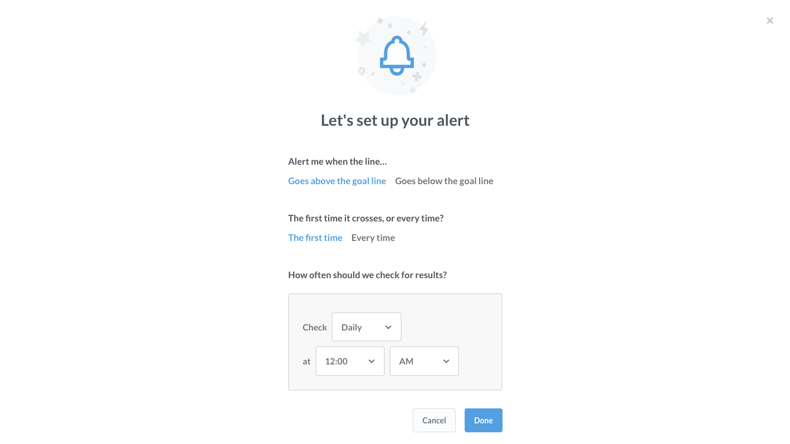
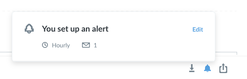
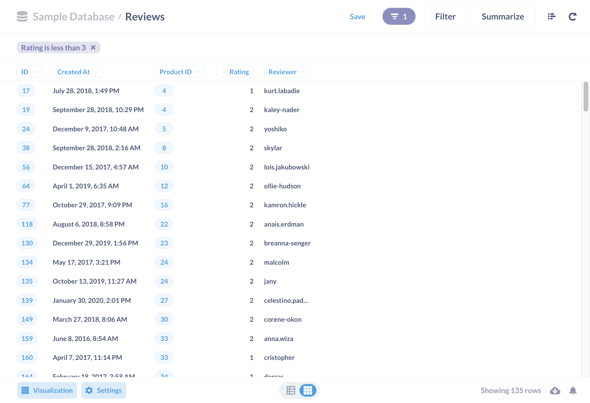
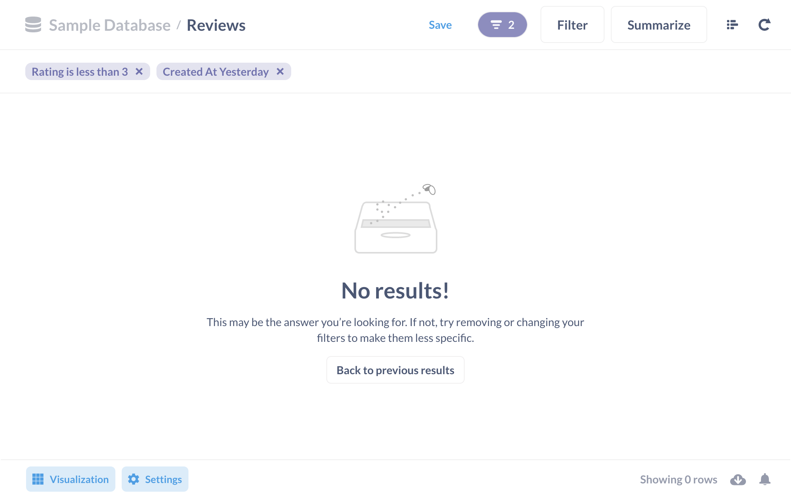
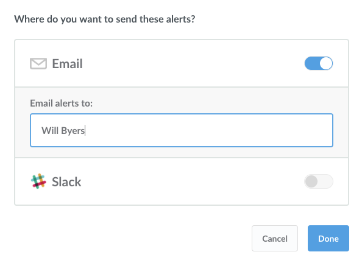

## Getting alerts about questions
Whether you're keeping track of revenue, users, or negative reviews, there are often times when you want to be alerted about something. Metabase has a few different kinds of alerts you can set up, and you can choose to be notified via email or Slack.

### Getting alerts
To start using alerts, someone on your team who's an administrator will need to make sure that [email integration](../administration-guide/02-setting-up-email.md) is set up first.

### Types of alerts
There are three kinds of things you can get alerted about in Metabase:
1. When a time series crosses a goal line.
2. When a progress bar reaches or goes below its goal.
3. When any other kind of question returns a result.

We'll go through these one by one.

### Goal line alerts
This kind of alert is useful when you're doing things like tracking daily active users and you want to know when you reach a certain number of them, or when you're tracking orders per week and you want to know whenever that number ever goes below a certain threshold.

To start, you'll need a line, area, or bar chart displaying a number over time. (If you need help with that, check out the page on [asking questions](04-asking-questions.md).)

Now we need to set up a goal line. To do that, open up the visualization settings by clicking the gear icon next to the dropdown where you chose your chart type. Then click on the Display tab, and turn on the "Show goal" setting. Choose a value for your goal and click Done.

Save your question, then click on the menu button in the top right of the screen and click on "Get alerts about this."

This is where you'll get to choose a few things:
- Whether you want to be alerted when the time series goes above the goal line or when it goes below it.
- Whether you only wanted to be alerted every time this happens or only the first time.
- How often you want Metabase to check to see if the goal line has been crossed.

Click Done, and your alert will be all set up! You'll get an email confirmation, too. If you need to edit or unsubscribe from the alert you set up, just open up that same menu. It'll say "Alerts are on," so just click that, and you'll see the Edit and Unsubscribe buttons. This is also where you'll see alerts about this question that administrators might have added you to.

### Progress bar alerts
Setting up this kind of alert is really similar to setting up a goal line alert. First, create a question that returns a single number as its result, then choose the Progress Bar chart type from the Visualization menu. Click the gear to select a goal value, click Done, then save your question.

Next, open up the menu in the top-right, click "Get alerts about this," and you'll see that same screen of options for when you want to get alerts about this progress bar.

### Results alerts
Lastly, you can get an alert when one of your saved questions returns any result. This kind of alert is the most useful if you have a question that doesn't *usually* return any results, but you just want to know when it *does*. For example, you might have a table called `Reviews`, and you want to know any time a customer leaves a bad review, which you consider to be anything below three stars. To set up an alert for this situation, you'd go and create a raw data question (i.e., a question that returns a list of reviews), and add a filter to only include results with one or two stars.

You probably don't want to be alerted about all the bad reviews you've *ever* gotten, but just recent ones, you'd probably also add a filter to only include results from yesterday or today, depending on how often you want to check for these bad reviews. At this point, when you check the results of this question, it probably won't return any results, which is a good thing.

Save the question, the click on "get alerts about this" from the menu in the top-right of the screen, and select how often you want Metabase to check this question for results. That's it!

### Adding additional recipients to your alerts
If you're an administrator of your Metabase instance, you'll be able to see and edit every alert on all saved questions. You'll also see some additional options to add recipients to alerts, which look like this:

Just like with [Pulses](10-pulses.md), you can add any Metabase user, email address, or even a Slack channel as a recipient of an alert. Admins can add or remove recipients on any alert, even ones that they did not create themselves.

Here's more information about [setting up email integration](../administration-guide/02-setting-up-email.md) and [setting up Slack integration](../administration-guide/09-setting-up-slack.md).

### Stopping alerts
There are a few ways alerts can be stopped:
- Regular users can unsubscribe from any alert that they're a recipient of.
- Admins can edit any alert and delete it entirely. This can't be undone, so be careful!
- If a saved question that has an alert on it gets edited in such a way that the alert doesn't make sense anymore, the alert will get deleted. For example, if a saved question with a goal line alert on it gets edited, and the goal line is removed entirely, that alert will get deleted.
- If a question gets archived, any alerts on it will be deleted.

## That’s it!
If you still have questions about using alerts, you can head over to our [discussion forum](http://discourse.metabase.com/). See you there!
