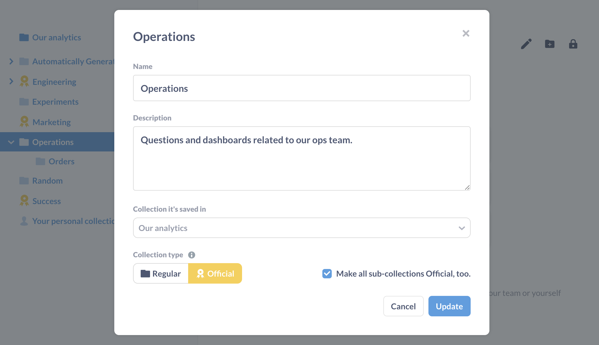
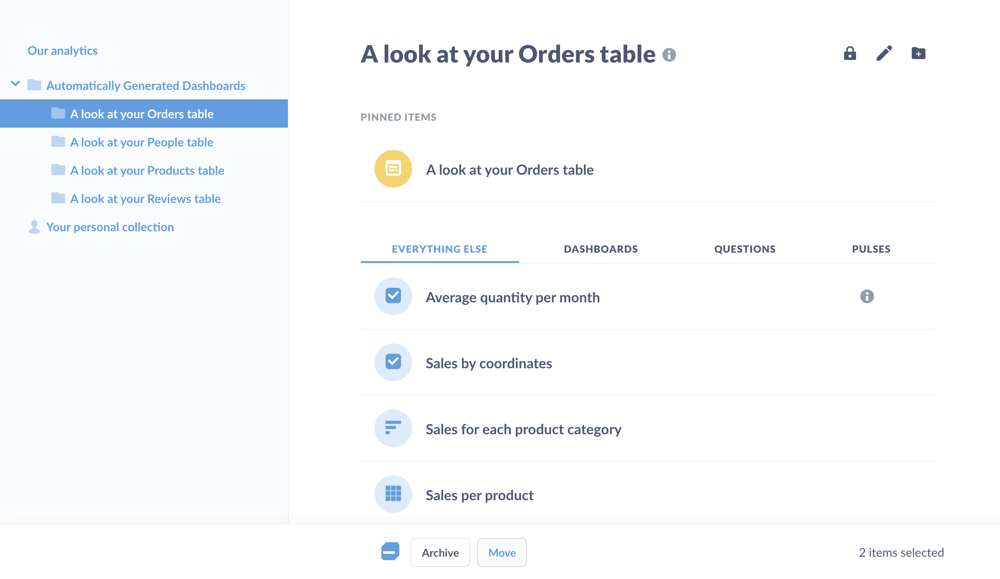

## Collections

 After your team has been using Metabase for a while, you’ll probably end up with lots of saved questions.

Collections are the main way to organize questions, as well as dashboards and pulses. You can think of them like folders or directories. You can nest collections in other collections, and move collections around. One thing to note is that a single item, like a question or dashboard, can only be in one collection at a time (excluding parent collections).

### Collection types

- **Regular collections**. They're just basic collections. You can put stuff in them.
- **Official collections**. These are special collections, in that they have a badge to let people know that the items in this collection are the ones people should be looking at (or whatever "official" means to you). Questions and dashboards in official collections are also more likely to show up at the top of search results.

### Collection permissions

[Administrators can give you different kinds of access](../administration-guide/06-collections.md) to each collection:

- **View access:** you can see the collection and its contents, but you can't modify anything or put anything new into the collection.
- **Curate access:** you can edit, move, or archive the collection and its contents. You can also move or save new things in it and create new collections inside of it, and can also pin items in the collection to the top of the screen. Only administrators can edit permissions for collections, however.
- **No access:** you can't see the collection or its contents. If you have access to a dashboard, but it contains questions that are saved in a collection you don't have access to, those questions will show a permissions notification instead of the chart or table.

### Your personal collection

In addition to the collections you and your teammates have made, you'll also always have your own personal collection that only you and administrators can see. To find it, click on the "browse all items" button on the homepage and click on "my personal collection" in the list of collections.

You can use your personal collection as a scratch space to put experiments and explorations that you don't think would be particularly interesting to the rest of your team, or as a work-in-progress space where you can work on things and then move them to a shared place once they're ready.

### Pinned items

In each collection, you can pin important or useful dashboards or questions to make them stick to the top of the screen. Pinned items will also be displayed as large cards to make them stand out well. If you have Curate permissions for a collection, you can pin and un-pin things, and drag and drop pins to change their order.

Any dashboards that are pinned in the main "Our analytics" collection will also show up on the homepage.

### Moving items from collection to collection

To move a question, dashboard, or pulse into a collection, or from one collection to another, just click and drag it onto the collection where you want it to go. You can also click on the `…` menu to the right of the question and pick the Move action. If you're trying to move several things at once, click on the items' icons to select them, then click the Move action that pops up at the bottom of the screen.

Note that you have to have Curate permission for the collection that you're moving a question into _and_ the collection you're moving the question out of.

### Search

Use the search bar to find dashboards, questions, collections, and pulses. You can select from the typeahead's dropdown results, or hit enter to view a search results page. You can also activate the search bar from anywhere by pressing the `/` key.

Searches take into account items’ titles, descriptions, and other metadata — you can even search the contents of your SQL queries. For example, you can search for things like `SELECT escape_pod FROM mothership` and find that one question you worked on six months ago. The results will display an item’s description, which collection it’s saved in, what kind of object it is, and whether it’s pinned. Note that you'll only ever see items in collections you have permission to view.

### Archiving items

Sometimes questions outlive their usefulness and need to be sent to Question Heaven. To archive a question or dashboard, just click on the `…` menu that appears on the far right when you hover over a question and pick the Archive action. You'll only see that option if you have "curate" permission for the current collection. You can also archive multiple items at once, the same way as you move multiple items. Note that archiving a question removes it from all dashboards or Pulses where it appears, so be careful!

You can also archive _collections_ if you have curate permissions for the collection you're trying to archive, the collection _it's_ inside of, as well as any and all collections inside of _it_. Archiving a collection archives all of its contents as well.

If you have second thoughts and want to bring an archived item back, you can see all your archived questions from the archive; click the menu icon in the top-right of any collection page to get to the archive. To unarchive a question, hover over it and click the unarchive icon that appears on the far right.

## Next: creating dashboards

Next, we'll learn about [creating dashboards and adding questions to them][dashboards].

[dashboards]: 07-dashboards.md

