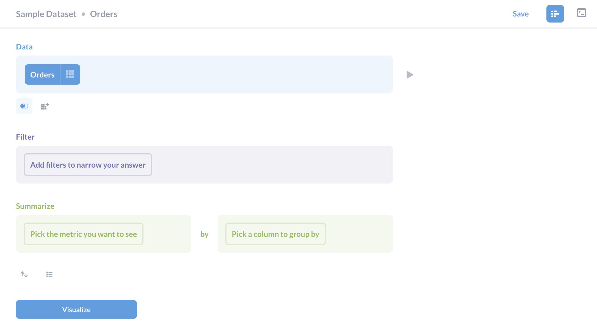
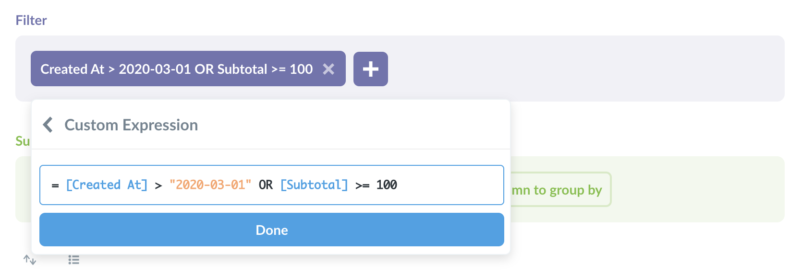
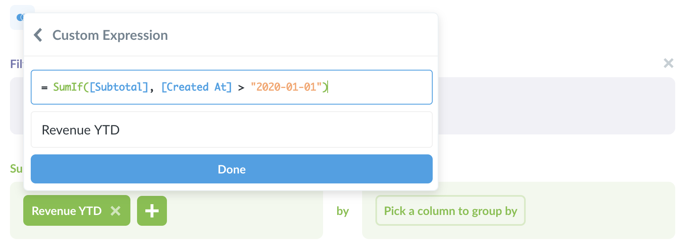
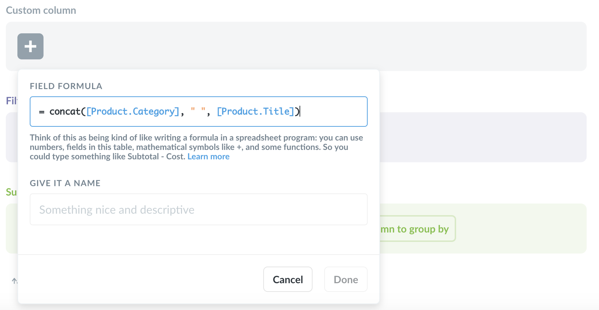

## Creating custom questions with the notebook editor

If you have a question that's a bit more involved than a [simple question](04-asking-questions.md), you can create a custom question using the notebook editor. You can get there by clicking the Ask a Question button in the top nav bar and selecting Custom Question. If you started from a Simple question or a saved question, you can get back to the custom question notebook editor by clicking the icon in the top-right of the screen.

### The parts of the notebook

The notebook is made up of a sequence of individual steps. Under each step you'll see buttons to add more steps after the current one. To the right of each step is a preview button that shows you the first 10 rows of the results of your question up to that step.

#### Picking your starting data

This first step is required, and is where you pick the data that you want to base your question on. In most cases you'll pick one of the tables in your database, but you can also choose a previously saved question's result as the starting point for your new question. What this means in practice is that you can do things like use complex SQL queries to create new tables that can be used as starting data in a question just like any other table in your database.

You can use most saved questions as source data, provided you have [permission](../administration-guide/05-setting-permissions.md) to view that question. You can even use questions that were saved as a chart rather than a table.

There are some kinds of saved questions that can't be used as source data:

- Druid questions
- Google Analytics questions
- Mongo questions
- questions that use `Cumulative Sum` or `Cumulative Count` aggregations
- questions that have columns that are named the same or similar thing, like `Count` and `Count 2`

#### Filtering

When you add a filter step, you can select one or more columns to filter on. Depending on the type of column you pick, you'll get different options, like a calendar for date columns. [Learn more about filtering](04-asking-questions.md).

You can add subsequent filter steps after every Summarize step. This lets you do things like summarize by the count of rows per month, and then add a filter on the `count` column to only include rows where the count is greater than 100. (This is basically like a SQL `HAVING` clause.)

**Filter expressions and including ORs in filters**

If you have a more complex filter you're trying to express, you can pick "Custom Expression" from the add-filter menu create a filter expression. You can use comparison operators like greater than (>) or less than (<), as well as spreadsheet-like functions. For example, `[Subtotal] > 100 OR median([Age]) < 40`. [Learn more about writing expressions](./expressions.md)

#### Summarizing

Adding a summarize step lets you choose how to aggregate the data from the previous step. You can pick one or more metrics, and optionally group those metrics by one or more columns. When picking your metrics you can choose from basic functions like sum, average, and count; or you can pick a common metric that an admin has defined; or you can create a custom expression by writing a formula.

If you summarize and add a grouping you can then summarize _again_. You can also add steps to filter and/or join in between. For example, your first summarization step could be to get the count of orders per month, and you could then add a second summarization step to get the average monthly order total by selecting the `Average of…` your `count` column.

**Custom expressions**

Custom expressions allow you to use spreadsheet-like functions and simple arithmetic within or between aggregation functions. For example, you could do `Average(sqrt[FieldX]) + Sum([FieldY])` or `Max(floor([FieldX] - [FieldY]))`, where `FieldX` and `FieldY` are fields in the currently selected table. [Learn more about writing expressions](./expressions.md)

#### Creating custom columns

Custom columns are helpful when you need to create a new column based on a calculation, such as subtracting the value of one column from another, or extracting a portion of an existing text column. Note that columns you add in a custom question are not permanently added to your table; they'll only be present in the given question.

You can use the following math operators in your formulas: `+`, `–`, `*` (multiplication), and `/` (division), along with a whole host of spreadsheet-like functions. You can also use parentheses to clarify the order of operations. You can [learn more about writing expressions here](./expressions.md).

#### Sorting results

The sorting step lets you pick one or more columns to sort your results by. For each column you pick, you can also choose whether to sort ascending or descending; just click the arrow to change from ascending (up arrow) to descending (down arrow).

#### Setting a row limit

The row limit step lets you limit how many rows you want from the previous results. When used in conjunction with sorting, this can let you do things like create a top-10 list, by first sorting by one of the columns in your result, then adding a row limit of 10. Unlike other steps, the row limit step can only be added at the end of your question.

#### Joining data

The join step allows you to combine your current data with another table, or even with a saved question.

Currently you can't use joins if your starting data is from a Google Analytics or MongoDB database.

After you click on the Join Data button to add a join step, you'll need to pick the data that you want to join. **Note:** You can only pick tables and saved questions that are from the same database as your starting data.

Next, you'll need to pick the columns you want to join on. This means you pick a column from the first table, and a column from the second table, and the join will stitch rows together where the value from the first column is equal to the value in the second column. A very common example is to join on an ID column in each table, so if you happened to pick a table to join on where there is a foreign key relationship between the tables, Metabase will automatically pick those corresponding ID columns for you. At the end of your join step, there's a `Columns` button you can click to choose which columns you want to include from the joined data.

By default, Metabase will do a left outer join, but you can click on the Venn diagram icon to select a different type of join. Not all databases support all types of joins, so Metabase will only display the options supported by the database you're using.

Here are the basic types of joins:

- **Left outer join:** select all records from Table A, along with records from Table B that meet the join condition, if any.
- **Right outer join:** select all records from Table B, along with records from Table A that meet the join condition, if any.
- **Inner join:** only select the records from Table A and B where the join condition is met.
- **Full outer join:** select all records from both tables, whether or not the join condition is met.

**A left outer join example:** If Table A is Orders and Table B is Customers, and assuming you do a join where the `customer_id` column in Orders is equal to the `ID` column in Customers, when you do a left outer join your results will be a full list of all your orders, and each order row will also display the columns of the customer who placed that order. Since a single customer can place many orders, a given customer's information might be repeated many times for different order rows. If there isn't a corresponding customer for a given order, the order's information will be shown, but the customer columns will just be blank for that row.

##### Multiple stages of joins

In many cases you might have tables A, B, and C, where A and B have a connection, and B and C have a connection, but A and C don't. If you want to join A to B to C, all you have to do is add multiple join steps. Click on Join Data, join table A to table B, then click the Join Data step below that completed join block to add a second join step, and join the results of your last join to table C.

### Viewing the SQL that powers your question

Under the hood, all Metabase questions are SQL (gasp!). If you're curious to see the SQL that will get run when you ask your question, you can click the little console icon in the top-right of the notebook editor. In the modal that opens up, you'll also be given the option to start a new query in the SQL editor, using this generated SQL as a starting point. It's a nice little shortcut to have Metabase write some boilerplate SQL for you, but then allows you to tweak and customize the query.

---

## Next: writing SQL

If you have a question that's even too much for the notebook, you can always fire up the trusty old [SQL editor](writing-sql.md).
