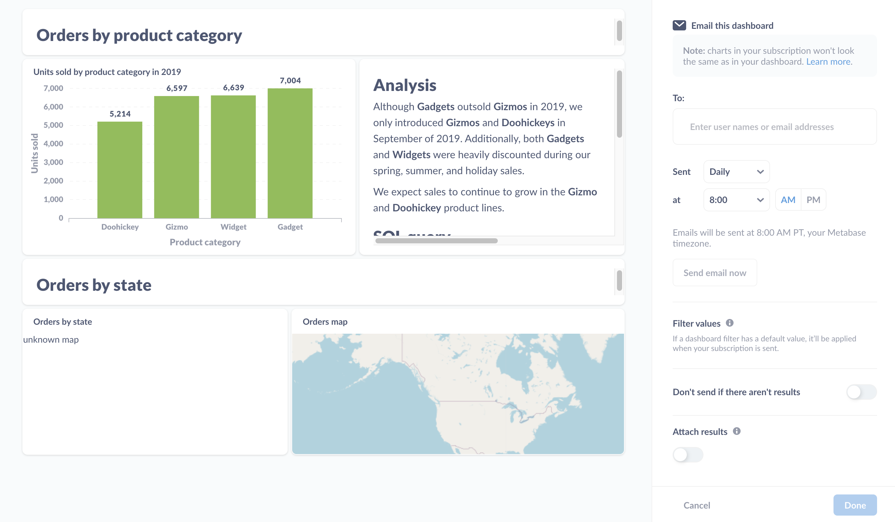

## Dashboard subscriptions

Dashboard subscriptions are a great way to keep you and your team up to date on the data that matters most. They allow you to send all of the questions on a dashboard via email or Slack. If your Metabase has email or Slack set up, all you need to do is create a dashboard, add subscribers to it, and tell Metabase how often you'd like the send out an update. You can set up as many subscriptions to a dashboard as you like, and if you make any changes to the dashboard, Metabase will update the subscriptions the next time they're delivered.

### Enabling dashboard subscriptions

To enable dashboard subscriptions, your administrators will need to have set up email or Slack for your Metabase. See [Setting up email](https://www.metabase.com/docs/latest/administration-guide/02-setting-up-email.html) or [Setting up Slack](https://www.metabase.com/docs/latest/administration-guide/09-setting-up-slack.html).

### Setting up a dashboard subscription

To set up a subscription to a dashboard, click on the **sharing** icon (the one-way arrow) and select **Dashboard subscriptions**.

Metabase will slide out a sidebar on the right, with an option to set up a subscription via email or Slack:

Let's say we want to email a dashboard. We'll click on the **Email it** option in the sidebar, and Metabase will give us some options:

### Email subscription options

For emails, we can:

- **Add subscribers**. Add email addresses to register subscribers.
- **Determine frequency and timing**. Tell Metabase how often it should send the dashboard (daily, weekly, or monthly), and what time of day to send the dashboard.
- **Send email now** sends an email to all subscribers.
- **Skip updates without results**. If there are no results, we can tell Metabase to skip sending the email.
- **Attach results**. Tell Metabase if it should also attach results to the email (which will include up to 2000 rows of data). You can choose between CSV and XLSX file formats.

If you've added filters to your dashboard and set default values for those filters, Metabase will apply those default values to your subscriptions, filtering the results of all questions that are connected to those filters when the subscriptions are sent. To learn more, check out [dashboard filters](https://www.metabase.com/docs/latest/users-guide/08-dashboard-filters.html).

### Email example

You'll notice in the email that Metabase excludes any text cards on the dashboard, and that the charts look different - Metabase reformats the charts to make them more legible in email. Additionally, tables that exceed either 10 columns or 20 rows get the rest of their results, up to 2000 rows, included as an attachment.

### Slack subscription options

For Slack subscriptions, you can set up a subscription for a channel (like #general), or for a single person via their Slack username.

You can specify how often Metabase sends a Slack message (hourly, daily, weekly, or monthly), and whether to send a message if the dashboard fails to return results.

### Adding multiple subscriptions

You can add multiple subscriptions to a single dashboard. To add a subscription, click on the **+** icon in the dashboard subscription panel.

### Deleting a subscription

To remove a subscription from a dashboard, select the subscription you'd like to remove. At the bottom of the sidebar, select **Delete this subscription**. Follow the instructions on the modal that pops up to confirm you'd like to delete the subscription.

## Enterprise Edition: customize filter values for each dashboard subscription

Metabase Enterprise Edition allows you to [customize filter values for each subscription](../enterprise-guide/dashboard-subscriptions.md), so you can set up subscriptions with different filter values applied for different subscribers.

### Related reading

- [Setting up email](https://www.metabase.com/docs/latest/administration-guide/02-setting-up-email.html)
- [Setting up Slack](https://www.metabase.com/docs/latest/administration-guide/09-setting-up-slack.html)

---

## Next: Getting reports with Pulses

Pulses let you send out a group of saved questions on a schedule via email or Slack. [Get started with Pulses](10-pulses.md).
