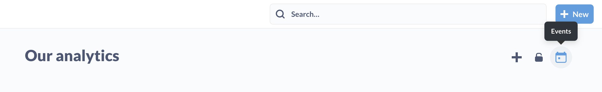
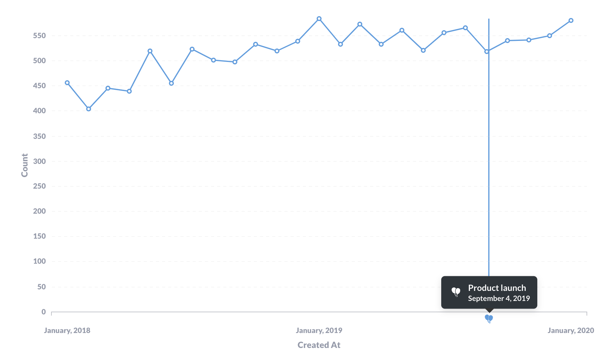

# Events and timelines

A lot of discussions around data have a moment when someone asks a question related to a specific point in time: "Wait, what's the spike in March again?", or "When did the new widget launch?"

Events and timelines are a way to capture that chronological knowledge and make it available when you need it, in context (that is, when you're viewing a chart). Events are a great way to store institutional knowledge about what happened and when, so people (including yourself three months from now) won't have to figure out (again) why the line chart spiked back in March.

## Events

An event is basically a date + a title + a description + an icon. You can add events to Metabase to show important milestones, launches, or anything else, right alongside your data.

## Timelines

You can group events into timelines, and associate those timelines with [collections](collections.md). For example, you may want to have a timeline that contains important email or sales dates, or an outages timeline that tracks downtime. You can move events between timelines, and move timelines from collection to collection.

Collections can have timelines, and timelines can contain events. In practice what this means is that events you've added to a timeline will show up on time series questions stored in the same collection as that timeline. Events are invisible on dashboards

## Event and timeline permissions

Anyone with [view access](../administration-guide/06-collections.md) to a collection can view the collection's events and timelines.

Anyone with curate access to a collection can add events and timelines to that collection.

### Adding events when viewing a collection

When viewing a [collection](collections.md), you can view, add, or edit events by clicking on the **calendar** icon in the upper right.

Once you create an event, the event will show up in charts in the collection, provided:

- the date of the event falls within the chart's time range, and
- the timeline is visible (more on that [below](#adding-events-when-viewing-a-question))

You'll see an icon along the x-axis that plots the event. A vertical line will extend from the event to show when the data plotted on the chart intersects with the event.

### Adding events when viewing a question

If your question is a time series, you can click on the **Calendar** in the bottom right of the question, and Metabase will open the timeline sidebar. Metabase will list any timelines and their events that fall in the range of your time series. You can:

- Toggle timeline visibility (including timelines from other collections)
- Add a new event (even if you haven't saved the question yet).
- Edit, move, or archive an event.

## Archiving and deleting

### Archiving events

You can archive both events and timelines to get them out of the way, or unarchive them to resurrect them.

To archive an event, click on the **...** next to the event and select **Archive event**.

To view archived events, navigate to the relevant collection and click on the **Calendar** icon, then the **...** menu to **View archived events**.

### Archiving timelines

To archive a timeline, click on the **...** next to the timeline and select **Edit timeline details**. Metabase will pop up an edit modal; click on **Archive timeline and all events**.

To resurrect an archived timeline, click on the **Calendar** icon in the relevant collection, then click on the **...** menu. Next to the timeline you want to unarchive, click on the **...** menu and select **Unarchive timeline**.

To permanently delete an event or timeline, you must first archive the event or timeline. Then you can delete the archived events from the **View archived events** modal, or timelines from the **View archived timelines** modal.

## Disabling events for a question

If a collection includes timelines, those events will show up for any time series in that collection (provided the timeline and the question's date range overlap). If you want to disable the visibility of events by default for a particular question, you'll need to move that question to a collection that lacks timelines and events.