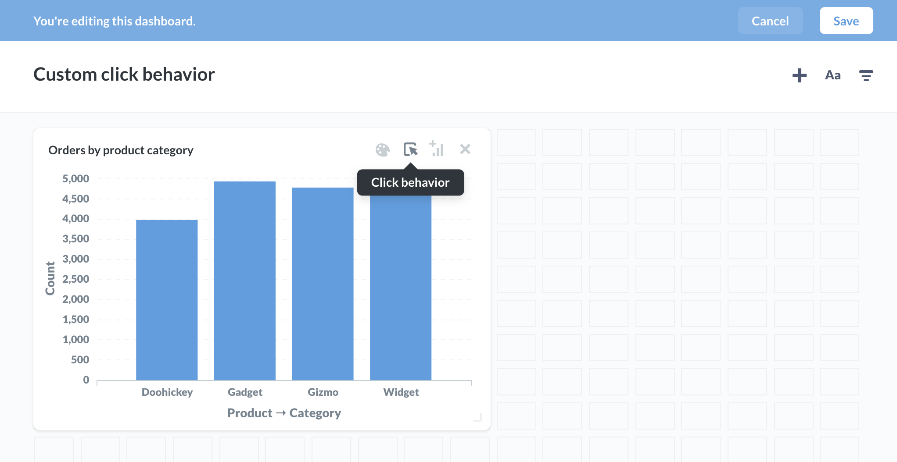
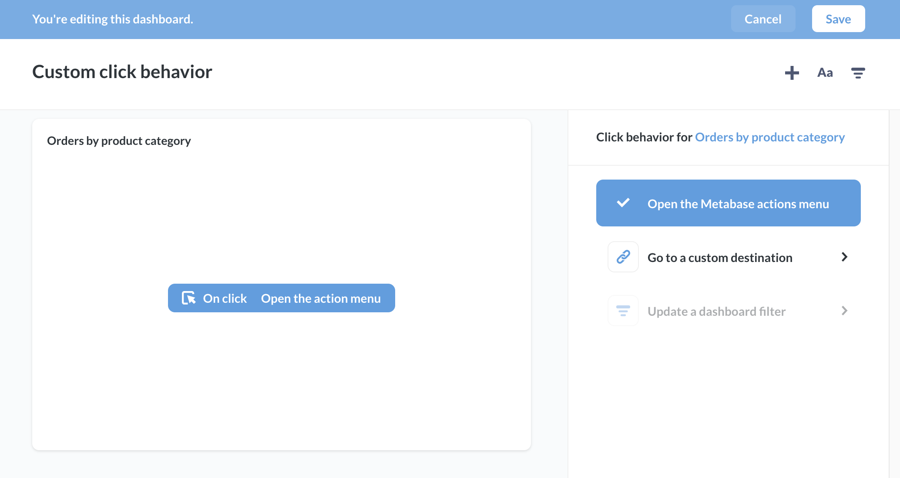
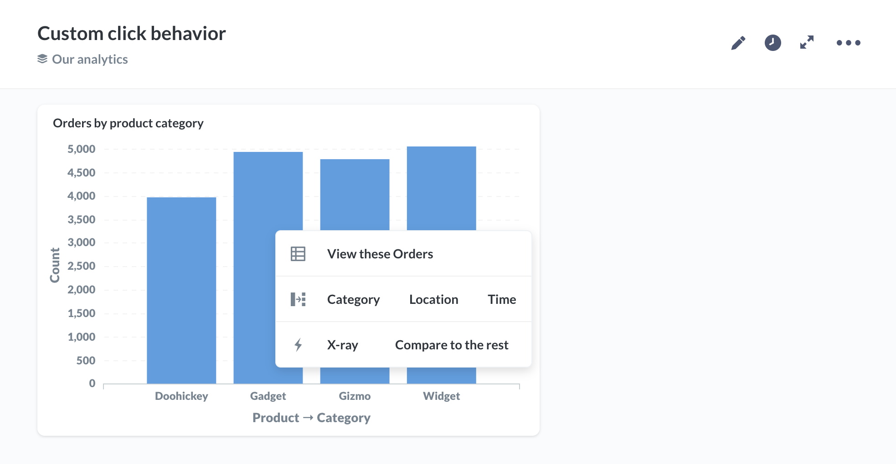
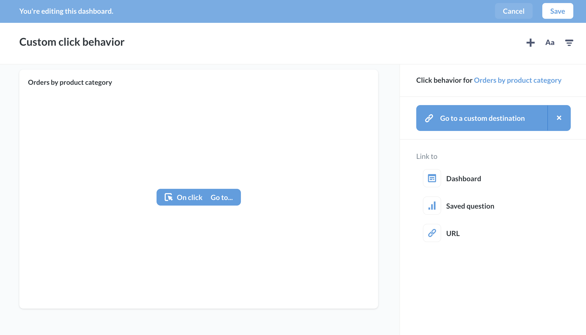
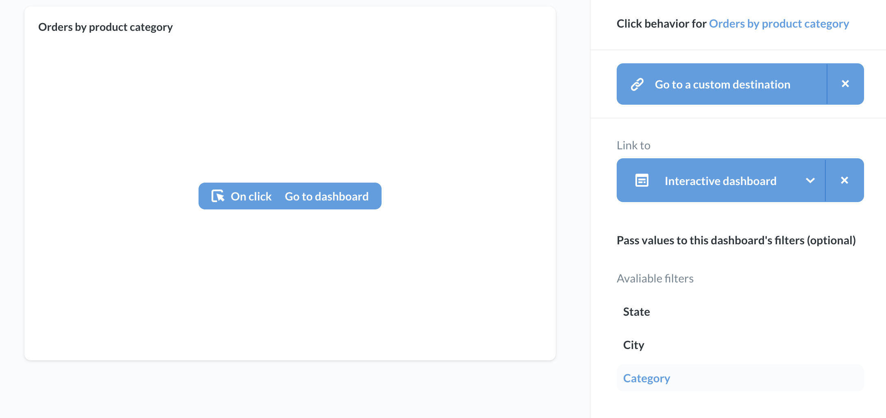
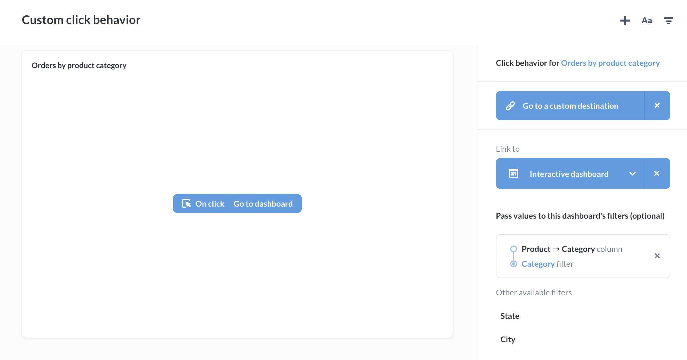
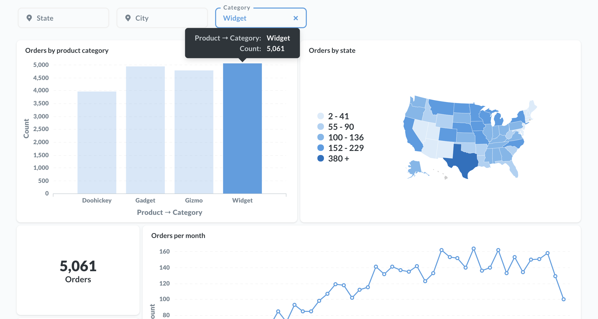
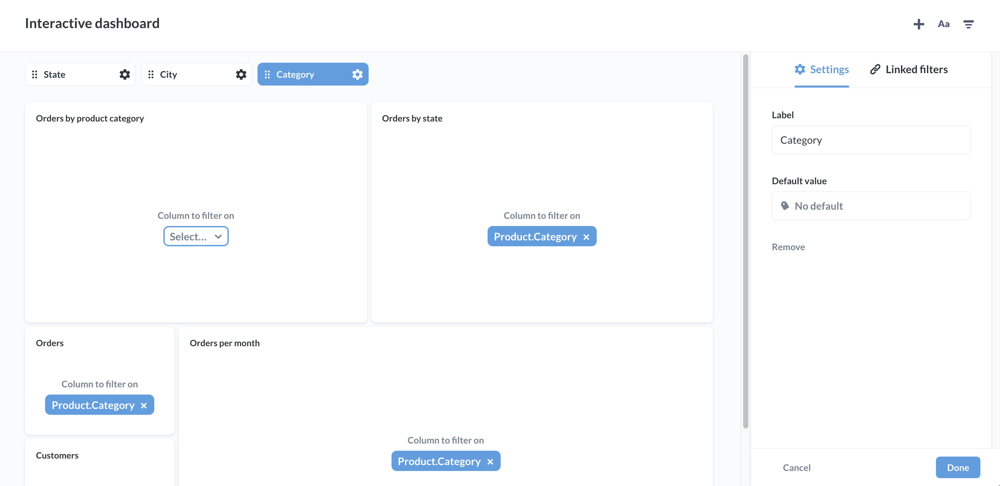
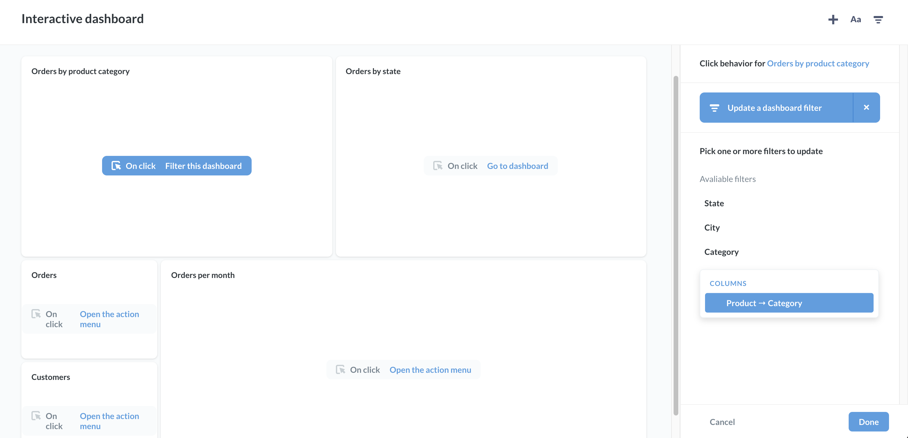

## Interactive dashboards

You can customize what happens when people click on questions in your dashboard. You can set up a question to:

- send the user to a custom destination: a dashboard, question, or custom URL 
- update a dashboard filter (what we call **cross-filtering**)

To configure this interactivity, you'll used the **click behavior** menu on a dashboard card.

### Click behavior sidebar

From your dashboard, click on the **pencil** icon to enter dashboard edit mode. Hover over the card containing the question you want to customize. Metabase will display a menu at the top right of the card. Select the **Click behavior** option (the icon with the mouse cursor clicking on a card). 

Metabase will slide out the **Click behavior** sidebar. For questions composed using the query builder, you can select from 2 options:

- Open the Metabase action menu.
- Go to a custom destination.
- Update a dashboard filter (if a filter exists)

SQL questions will only have the option to **Go to a custom destination**, and **Update a dashboard filter**, as the action menu (which allows users to drill through the data) is only available to questions composed with the query builder.

If your dashboard has a filter, you'll also see an option to update the filter (see [cross-filtering](#cross---filtering) below).

### Open the action menu

For questions composed using the query builder, the default click behavior is to open the **action menu**, which presents people with the option to drill through the data:

### Custom destination

You can set custom destinations for all questions, including SQL questions. 

Possible destinations include:

- Dashboards
- Saved questions
- URLs

You can also pass a value to that destination from the clicked card. For example, if you link to a dashboard that has a filter for category, you can pass a value for category from the origin question to the destination dashboard:

Once you select a column, Metabase will display the column used to pass the value, as well as the filter the value will be passed to at the destination dashboard.

In the example above, when a user clicks on the **Orders by product category** card, Metabase will pass the clicked category to the destination dashboard, which will then filter its cards by that category.

You can also use values to construct URLs to external resources.

### Cross-filtering a dashboard

If your dashboard contains a filter, you can use a chart to update the value supplied to that filter. 

When a user clicks on, say, a bar in a bar chart, the click sends the value of the bar to the filter, and updates cards across the dashboard. We call this functionality **cross-filtering**. You can use this cross-filtering to make a chart behave as kind of "navigation question" that filters data across other cards.

For example, clicking on the `Widget` bar will update the current dashboard's **category** filter to filter for `Widget`:

To set this cross-filtering up, choose a dashboard filter to update, and a question that you want to update that filter. You can think of this question as your "navigation question". Instead of wiring this navigation question up to the filter, you'll [wire up every other question on the dashboard to the filter](08-dashboard-filters.md). Here, we use the **Orders by product category question** as our navigation question, so we leave this question disconnected from the filter, and connect all the other questions to the **Category** filter.

When you click on a value in the navigation question, the navigation question won't update (which allows us to select other values), but all the other questions will update.

With your filter wired up, stay in dashboard edit mode, and hover over the question you want to use to filter the dashboard, and click on the **click behavior** icon. Then select the **Update a dashboard filter**.

Metabase will list the available filters to update below. Here we select the **Category** filter, and supply the value to that filter from the question's `Product -> Category` column.

Click **Done** in the sidebar, then **Save** your dashboard. Now you can use your navigation question to interactively filter the data across your dashboard.

---

## Next: Charts with multiple series

We'll learn how to [create charts with multiple lines, bars, and more](09-multi-series-charting.md).
