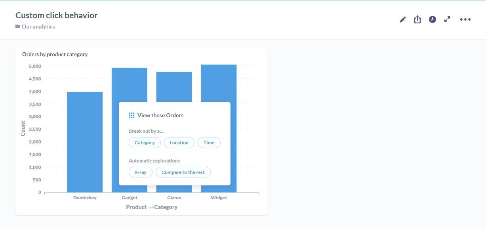

## Interactive dashboards

You can customize what happens when people click on questions in your dashboard. You can set up a question to:

- send the user to a custom destination: a dashboard, question, or custom URL 
- update a dashboard filter (what we call **cross-filtering**)

To configure this interactivity, you'll used the **click behavior** menu on a dashboard card.

### Click behavior sidebar

From your dashboard, click on the **pencil** icon to enter dashboard edit mode. Hover over the card containing the question you want to customize. Metabase will display a menu at the top right of the card. Select the **Click behavior** option (the icon with the mouse cursor clicking on a card). 

Metabase will slide out the **Click behavior** sidebar. For questions composed using the query builder, you can select from 2 options:

- Open the Metabase action menu.
- Go to a custom destination.
- Update a dashboard filter (if a filter exists)

SQL questions will only have the option to **Go to a custom destination**, and **Update a dashboard filter**, as the action menu (which allows users to drill through the data) is only available to questions composed with the query builder.

If your dashboard has a filter, you'll also see an option to update the filter (see [cross-filtering](#cross---filtering) below).

### Open the action menu

For questions composed using the query builder, the default click behavior is to open the **action menu**, which presents people with the option to drill through the data:

### Custom destination

You can set custom destinations for all questions, including SQL questions. 

Possible destinations include:

- Dashboards
- Saved questions
- URLs

#### Dashboards

#### Saved Questions

#### URLs

You can also construct a custom URL

### Cross-filtering

If your dashboard contains a filter, you can use a chart to update the value supplied to that filter. When a user clicks on, say, a bar in a bar chart, the click sends the value of the bar to the filter, and updates cards across the dashboard. 

We call this functionality cross-filtering. You can use this cross-filtering to make a chart behave as kind of filter navigation.

