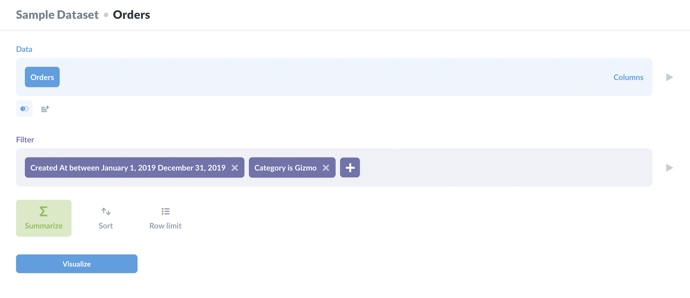
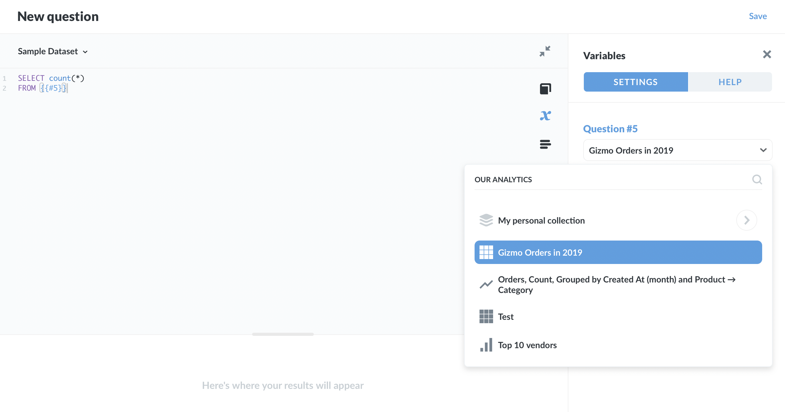

## Referencing saved questions in queries

With SQL databases, we can use an existing question as the basis for a new query, or as a common table expression (CTE). For example, let's say we have a lot of data spread across a number of tables, but our users are most interested in a subset of that data. We can perform a complicated query once to return those results, which people can refer to in their queries just like they would with any other table.

Here's how it works. First, create and save a question that returns the result set you'd like to make available for people to query. Using the sample dataset included with Metabase as an example, let's say we want to provide a result set (a "table") that only has orders from 2019, and only includes orders for products in the Gizmo category.

We could create this question using the notebook editor, like so:

.

Alternatively, we could create that question using SQL:

```
SELECT *
FROM   orders AS o
       INNER JOIN products AS p
               ON o.product_id = p.id
WHERE  p.category = 'Gizmo'
       AND o.created_at BETWEEN '2019-01-01' AND '2019-12-31'
```

We'll save that question as "Gizmo orders in 2019".

Now let's refer to "Gizmo orders in 2019" in a new query. To keep it simple, let's say we just want to count all of those Gizmo orders from 2019. We can use the `#` symbol to refer to a saved question in a query.

If we type out:

```
SELECT count(*)
FROM {{#
```

Metabase will slide out a sidebar where we can select a question to reference. We'll search for our "Gizmo orders in 2019" question:



We'll select that question, and Metabase will update our code with the question's ID, `5`:

```
SELECT count(*)
FROM {{#5}}
```

This query returns the number of rows in our saved question.

## Saved question as a Common Table Expression (CTE)

The same syntax can be used in [Common Table Expressions (CTEs)](https://en.wikipedia.org/wiki/Hierarchical_and_recursive_queries_in_SQL#Common_table_expression) (with SQL databases that support CTEs):

```
WITH 2019_gizmo_orders AS {{#5}}
SELECT count(*)
FROM 2019_gizmo_orders
```

When this query is run, the `{{#5}}` tag will be substituted with the SQL query of the referenced question, surrounded by parentheses. So it'll look like this under the hood:

```
WITH 2019_gizmo_orders AS (SELECT *
FROM   orders AS o
       INNER JOIN products AS p
               ON o.product_id = p.id
WHERE  p.category = 'Gizmo'
       AND o.created_at BETWEEN '2019-01-01' AND '2019-12-31')
SELECT count(*)
FROM 2019_gizmo_orders
```

# How to find a question's ID

- Selecting a question from the variable sidebar in the SQL editor will automatically add the ID number to the variable in our query.
- You can also navigate to the question you'd like to reference and find its ID at the end of the URL in your browser's address bar, after `/question/`. E.g., for `https://metabase.example.com/question/12345`, the question's ID would be `12345`.

## When and why to use saved questions as a data source

- If you can't create a view in the database, since saved questions effectively act as views. If you can create a view, and you expect that you and others will frequently query the results, consider creating a materialized view. The results will be stored in the database (as opposed to computed each time), which will speed up query time.
- To simplify or standardize queries for people. If you have data split across multiple tables, you can perform those complicated joins once, and provide the results as a simplified "table" that people can query.

For other ways to standardize analytics, check out:

- [Segments and Metrics](../administration-guide/07-segments-and-metrics.md)
- [SQL Snippets](https://www.metabase.com/learn/building-analytics/sql-templates/sql-snippets.html)
- [SQL Snippets vs Saved Questions vs. Views](https://www.metabase.com/learn/building-analytics/sql-templates/organizing-sql.html)

### Limitations and tradeoffs

- You can only reference a saved question in a query when working with a SQL database like PostgreSQL, MySQL, or SQL Server.
- The saved question you select has to be one that's based on the same database as the one you've currently selected in the native query editor.
- You cannot reference variables in sub-queries. You only have access to the _results_ of the saved question, not the saved question's query. For example, if you have a saved question that uses a [field filter](https://www.metabase.com/learn/building-analytics/sql-templates/field-filters), you won't be able to reference that variable. If you need to change how the saved question has filtered the results, you'll need to update (or duplicate) that question and apply the filter.

---

## Next: automated X-ray explorations

Learn about how to easily and quickly see automatic explorations of your data with Metabase's powerful [X-ray feature](14-x-rays.md).
