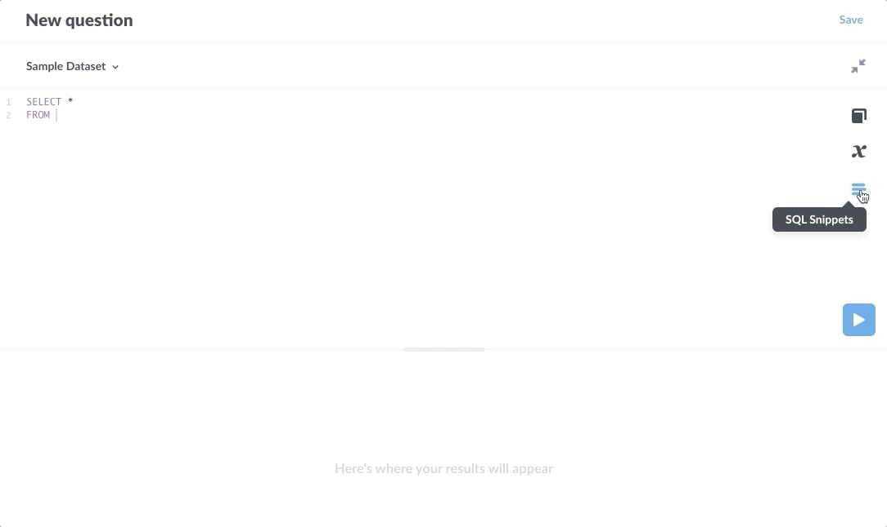

## SQL snippets


**SQL snippets** are reusable bits of SQL or native queries. Anyone with permissions to the [SQL editor](writing-sql.md) can create and edit snippets, which are then available for all SQL authors.

For example, if you frequently perform queries that involve multiple tables, you can save the SQL code that joins those tables as a snippet so that you (and others in your organization) can reuse that code in multiple questions.

### How to create a snippet

Here's a simple query with a join using the **Sample Dataset** included with Metabase.

```
SELECT *
FROM orders AS o
LEFT JOIN products AS p 
ON o.product_id = p.id
```

Let's save everything after FROM as a snippet to reuse in other queries.

In the **SQL editor**:
 
1. **Highlight a section of SQL** that you want to save. In this case, we'll select the following SQL code:

    ```
    orders AS o
    LEFT JOIN products AS p 
    ON o.product_id = p.id
    ```

2. **Right-click on the highlighted section.**
3. **Select Save as snippet** to create a snippet. A modal will pop up with the SQL statement you highlighted. 
4. **Edit, name, and describe your snippet**. Snippet names must be unique. Click the save button to create the snippet.

In this case, we named the snippet "Orders and Products". The snippet will now be available for anyone to use. Here's what the snippet looks like in the SQL editor:

```
SELECT * 
FROM {{snippet: Orders and Products}}
```

When writing in the SQL editor, you can now start typing `{{snippet:}}` and Metabase will present autocomplete options for available snippets.

Note: if you use aliases in a snippet, you'll need to observe those aliases outside of the snippet as well. For example, if a snippet aliases `products AS p`, code outside of the snippet will need to use the alias `p` to reference columns in that table (as in `p.column_name`).

### Snippet menu



The SQL editor **sidebar** has a **SQL Snippets** menu to list available and archived snippets.

Click on the snippet icon on the right side of the SQL editor, below the Data Reference book icon and the Variables χ icon. Metabase will slide out a sidebar menu that lists available snippets.

From the SQL Snippets menu, you can:

- **Create a snippet.** Click on the `+` in the upper right of the SQL Snippets sidebar to create a new snippet.
- **Preview snippets.** Click on the down arrow to the right of a snippet to see its description and a preview of its SQL code. There's also an option to edit the snippet.
- **Insert a snippet.** Click on a snippet's name to insert it into your query at the cursor's current location.
- **Search for snippets**. If you've saved over 15 snippets, a **Search** icon (the classic magnifying glass) will appear to the left of the `+` button. Note that search results only include snippets the user has permissions for. SQL snippet folders do not populate the search results.
- [**Edit a snippet.**](#editing-snippets) You can change a snippet's name, description and code.
- [**Archive and unarchive a snippet.**](#archiving-snippets) From the Edit modal, you can archive a snippet, which removes the snippet from the snippet menu and autocomplete options in the SQL editor.

### Editing snippets

You can **edit** a snippet at any time by selecting the snippet from the SQL Snippets sidebar menu in the SQL editor. Click on the down arrow to the right of the snippet, then click **Edit**. You can change the SQL code, snippet name, and snippet description.

Editing snippets is a great way to make changes to many questions at once. If, for example, you've saved the SQL code to pull user data from tables X, Y, and Z as the snippet `User Data`, but you need to change how that data is pulled (such as by adding data from another column or table), you can update the SQL code in the snippet, and all questions that use the snippet `User Data` will have the updated code. 

**Editing a snippet's name**. Changing a snippet's name will update the snippet's name in every question that uses that snippet. It won't break any existing questions (the underlying SQL remains unchanged), but be aware that other users may be caught off guard to discover you renamed a snippet they use frequently from "Orders and Products" to "All the things", or whatever.

**Editing a snippet's SQL.** Here's where we have to remind you that with great power comes great responsibility. There is one major caveat when editing snippets, worthy of a callout:

> **Caution: if you edit a snippet and include broken code, you will break every question that uses that snippet.** Make sure to test your code before saving it to an existing snippet.

### Archiving snippets

**Archiving** snippets can help keep dated or less relevant snippets out of the way. When you archive a snippet, the snippet no longer populates in the snippet autocomplete dropdown, and the snippet will no longer show up in the main list of of snippets in the **SQL editor** sidebar.

Archiving a snippet does not affect any existing queries that use the snippet, so you can safely archive a snippet without impacting any questions.

You can access an archived snippet from the snippet sidebar menu by clicking on the archived button in the bottom left of the sidebar.

Although there is no way to delete a snippet, you can archive and unarchive a snippet at any time. 

Note: two snippets cannot share the same name, as even if a snippet is archived, that snippet might still be active in questions.

### Snippet permissions

Any user who has SQL editor permissions to at least one of your connected databases will be able to view the snippets sidebar, and will be able to create, edit, and archive or unarchive any and all snippets — even snippets intended to be used with databases the user does NOT have SQL editing access to.

[Metabase Enterprise Edition](https://www.metabase.com/enterprise/) contains additional functionality for organizing snippets into folders and setting permissions on those folders. See our [docs on SQL snippet folders and permissions](../enterprise-guide/sql-snippets) to learn more.
