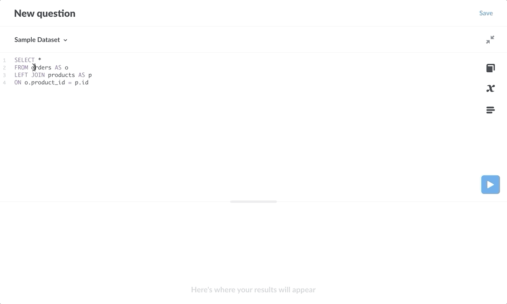

## SQL snippets



**SQL snippets** are reusable bits of SQL. Anyone with permissions to the [SQL editor](writing-sql.md) can create and edit snippets, and those snippets become available for all to take advantage of (provided they have permissions to the data, of course).

For example, if you frequently perform queries that involve multiple tables, you can save the SQL code that joins those tables as a snippet so that you (and others in your organization) can reuse that code in multiple questions.

### How to create a snippet

Here's a simple query with a simple join using the **Sample Dataset** included with Metabase.

```sql
select *
from ORDERS
left join PRODUCTS on PRODUCT_ID = PRODUCT_ID;
```

Let's save the join statement as a snippet to reuse in other queries.

In the **SQL editor**:
 
1. **Highlight a section of SQL** that you want to snip. In this case, we'll snip:
```
from ORDERS 
left join PRODUCTS on PRODUCT_ID = PRODUCT_ID
```

2. **Right-click on the highlighted section**.
3. **Select Save as snippet** to create a snippet. A modal will pop up with the SQL statement you highlighted. 
4. **Edit, name, and describe your snippet**, then click the save button.

In this case, we named the snippet "Orders and Products". The snippet will now be available for anyone to use. Here's what the snippet looks like in the SQL editor:

```
select * 
{{snippet: Orders and Products}};
```

When editing in the SQL editor, you can now start typing `{{snippet:` and Metabase will present autocomplete options for available snippets.

### Snippet menu


The SQL editor **sidebar** has a snippets menu to list available and archived snippets.

Click on the code icon on the right side of the SQL editor, below the **Data Reference** book icon (learn about your data) and the **Variables** χ icon. Metabase will slide out a sibebar menu that lists available snippets.

From the Snippet menu, you can:


- **Preview snippets**. Click on the down arrow to the right of a snippet to see a preview of its SQL code. There's also an option to edit the snippet.

- **Insert a snippet at point**: Click on a snippet to insert it into your query at the current cursor point.

### Editing snippets

You can **edit** a snippet at any time by selecting the snippet from the snippet sidebar menu in the SQL editor. Click on the down arrow to the right of the snippet, then click **Edit**. You can change the SQL code, snippet name, and snippet description.

Editing snippets is a great way to make changes to many questions at once. If, for example, you've saved the SQL code to pull user data from tables X, Y, and Z as the snippet `User Data`, but you need to change how that data is pulled (such as by adding data from another column or table), you can update the SQL code in the snippet, and all questions that use the snippet `User Data` will have the updated code. 

But with great power, comes great responsibility; there are two major caveats when editing snippets, both worthy of blockquote callouts:

> **Caution when editing code in snippets**: if you edit the snippet and include broken code, you will break every question that uses that snippet, so be sure to test your code before saving it to an existing snippet.

> **Caution when renaming snippets**: if you rename a snippet, any existing questions that refer to that original snippet name will break.

### Archived snippets

**Archiving** snippets can help keep dated or less relevant snippets out of the way. When you archive a snippet, the snippet no longer populates in the snippet autocomplete dropdown, and the snippet will no longer show up in the main list of of snippets in the **SQL editor** sidebar.

Archiving a snippet does not affect any existing queries that use the snippet, so you can safely archive a snippet without impacting any questions.

You can access an archived snippet from the snippet sidebar menu by clicking on the archived button in the bottom left of the sidebar.

Although there is no way to delete a snippet (eternal snippets are a safety measure to prevent the inadvertent breaking of questions that use those snippets), you can archive and unarchive a snippet at any time.

