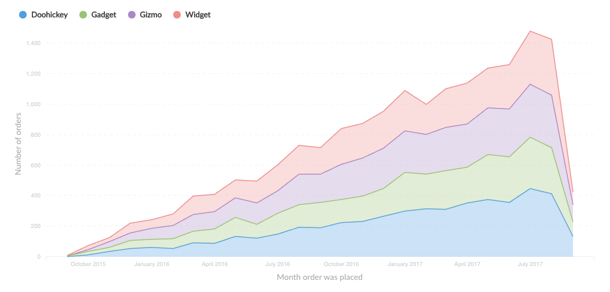

### Line, bar, and area charts

**Line charts** are best for displaying the trend of a number over time, especially when you have lots of x-axis values. For more, check out our [Guide to line charts](https://www.metabase.com/learn/basics/visualizing-data/line-charts.html).

Bar charts are great for displaying a number grouped by a category (e.g., the number of users you have by country). Bar charts can also be useful for showing a number over time if you have a smaller number of x-axis values (like orders per month this year).

Learn more about [Bar charts](https://www.metabase.com/learn/basics/visualizing-data/bar-charts.html).

**Area charts** are useful when comparing the proportions of two metrics over time. Both bar and area charts can be stacked.

**Trend lines**

**Trend lines** are another useful option for line, area, bar, and scatter charts. If you have a question where you're grouping by a time field, open up the visualization settings and turn the `Show trend line` toggle on to display a trend line. Metabase will choose the best type of line to fit to the trend of your series. Trend lines will even work if you have multiple metrics selected in your summary. But trend lines won't work if you have any groupings beyond the one time field.

