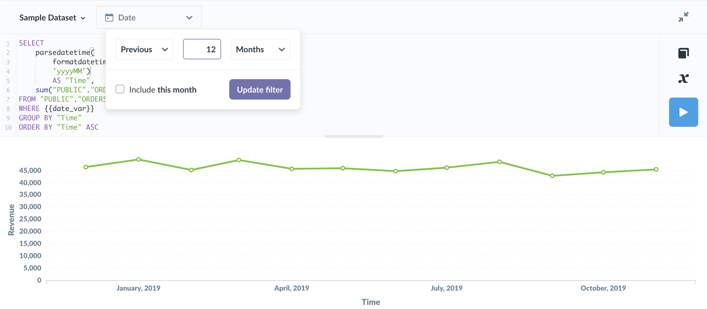

## Asking more advanced questions in the SQL/native query editor

If you ever need to ask questions that can't be expressed using the question builder, you can use **SQL** instead.

### What's SQL?

SQL (pronounced "sequel") stands for Structured Query Language, and is a widely used standard for getting data from databases. We won't try to teach you all about SQL in this guide, but to learn more about it, check out this [SQL Tutorial](http://www.w3schools.com/sql/default.asp).

Even if you don't understand SQL or how to use it, it's worthwhile to understand how works inside Metabase because sometimes other people will share SQL-based questions that might be useful to you.

### Starting a new SQL query

If you have the [permissions](../administration-guide/05-setting-permissions.md) to use the SQL editor, when you click the Ask a Question button you'll see an option to start a new SQL query. There's also a shortcut to the editor in the top nav bar; it's the little console icon.

You can write SQL (or your database's native querying language) directly into the editor that appears.

To try it out, select the Sample Dataset, then type the command `select sum(subtotal), created_at from orders group by created_at`. Don't worry if you don't understand this just yet. Click the blue run button and note the table that comes back is the same as if you had asked for the sum of Subtotal in the Orders table, grouped by Created At.

**Tip:** You can run your SQL query by pressing **ctrl + enter** on Windows and Linux, or **⌘ + return** on a Mac. You can also run only the selected section of a query by highlighting the part you'd like to run before clicking the run button or using the run shortcut key.

Questions asked using SQL can be saved, downloaded, or added to a dashboard just like questions asked using the question builder.

### Using SQL filters

If you or someone else wrote a SQL query that includes [variables](13-sql-parameters.md), your question might have filter widgets at the top of the screen. Filter widgets let you modify the SQL query before it's run, changing the results you might get.

Writing SQL queries that use variables or parameters can be very powerful, but it's also a bit more advanced, so that topic has its own page if you'd like to [learn more](13-sql-parameters.md).

### SQL snippets

You can use [SQL snippets](sql-snippets.md) to save, reuse, and share SQL code across multiple questions that are composed using the SQL editor.

---

## Next: Creating charts

Now that you have an answer to your question, you can learn about [visualizing answers](05-visualizing-results.md).
