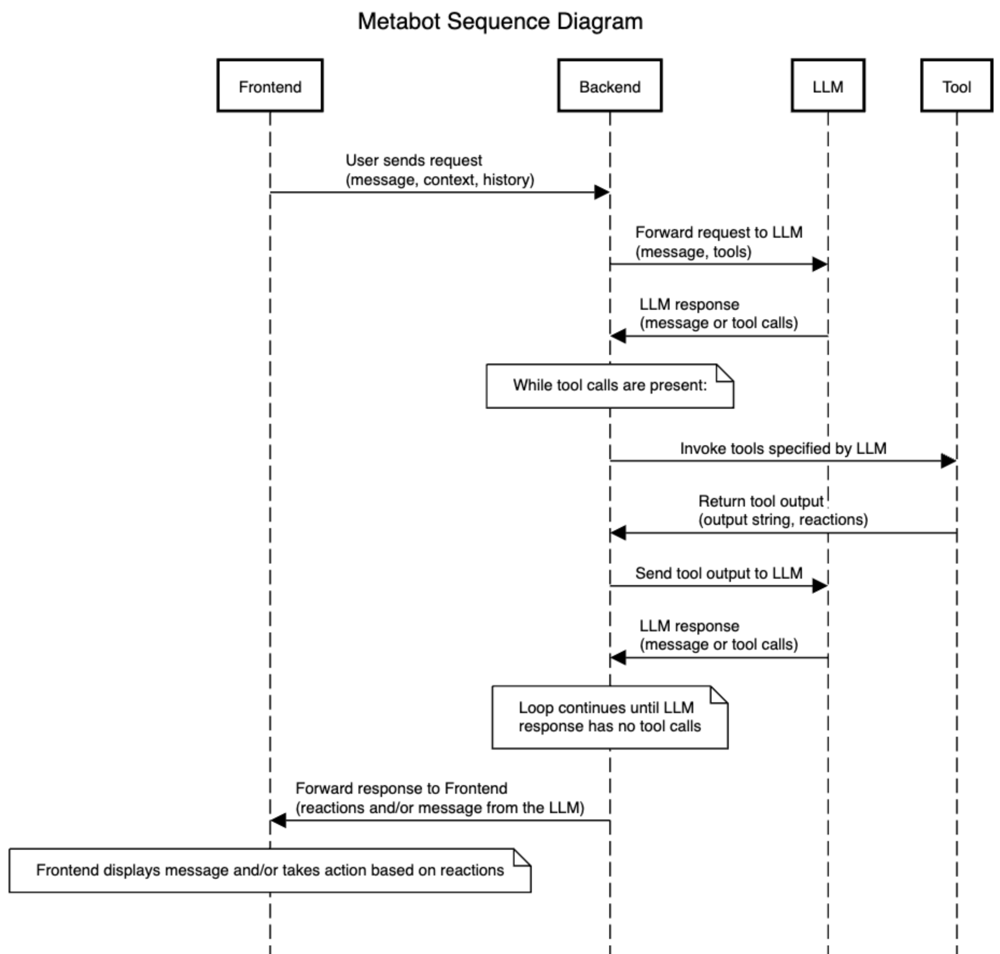

# Metabot V3

Welcome to Metabot V3!

The main entrypoint is `metabot-v3.api`, which provides a single route, `POST api/ee/metabot-v3/agent`.

This takes three arguments:

- message (a non-blank string, the message from the user or possibly from another system that we want the LLM to
  interpret)
  
- context:

``` json
  "context": {
        "current_time_with_timezone": <timestamp>,
        "current_page": { // LLM understandable context of what this page is about (purpose)
            "name": "Visualizer",
            "description": "A page where query results are visualized."
        },
        "current_visualization_settings": {
            "current_display_type": "table",
            "visible_columns": [{"name": "foo"}],
            "hidden_columns": [{"name": "bar"}]
        }
    }

```

- history, a collection of previous messages

Note that all requests are completely stateless: we don't maintain any internal history on the server, and the LLM
doesn't get any history that isn't sent in by the frontend.

When we receive a request, we build an `envelope`. The `envelope` is just a bundle of data, including the context and
history of the conversation, as well as some other details we need to handle the request correctly (for example, it
keeps track of the maximum number of round-trip requests to the LLM we'll do for a given API call, and errors if we
exceed that). The `metabot-v3.envelope` namespace provides utility functions for modifying or querying the `envelope`
to see what we should do, or to "modify" the envelope to include new results.

This brings us to `metabot-v3.handle-envelope/handle-envelope`. This contains the business logic that controls the
flow of a given `envelope`.

For background, when we invoke the LLM, it will either respond with a message for the user, or with "tool-calls" that
invoke external tools.

So, when we `handle-envelope`, we loop as follows:

- if we need to invoke the LLM, as when the most recent message is from the user, we do so and update the `envelope`
  with the response

- if we need to invoke a tool, we do so

- if we don't need to invoke the LLM or a tool (the most recent message is from the LLM, and it's not a tool call), we
  return the `envelope` unchanged
  
Why invoke the LLM multiple times for a single API request? This supports things like the following:

- the user asks Metabot to add some user to a group
- the LLM invokes two tools: one to look up the user, one to look up the group
- the tools are invoked and we respond to the LLM
- the LLM invokes a third tool to add the user to the group
- the tool is invoked, the user is added to the group, and we respond to the LLM
- the LLM writes a user-friendly message about what just happened, which is displayed to the user.

Each time we invoke a tool, it returns:

- an "output" - a string response that is sent to the LLM as a response to the tool call, and

- zero or more "reactions" - strictly typed data structures telling the *frontend* about things that happened, or
  should happen.
  
As an example, the tool to change the data visualization type to a bar chart can just have an output of "success",
telling the LLM that the tool was invoked successfully. Then, we'll tell the frontend to actually change the viz type
with a reaction.

The overall flow looks like this:


