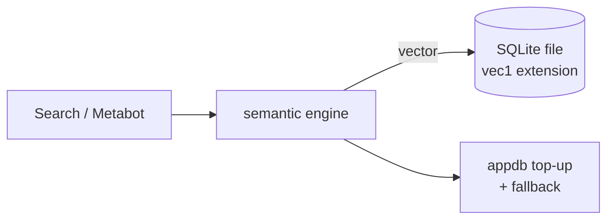
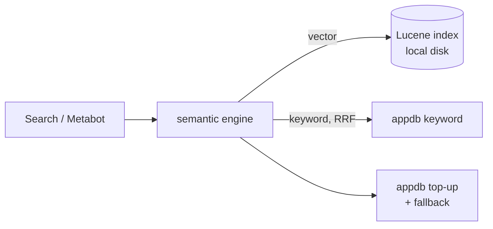

<!--
  Demo deck: semantic search without pgvector (Hackathon 2026).
  Serve:  python3 -m http.server 8077 -d hackathon/deck   → http://localhost:8077
  (runs offline: reveal.js and mermaid are vendored in vendor/). Speaker view: press `s`.
  `---` = next slide, `--` = vertical slide, `Note:` starts speaker notes.
  Owner: Agent K. Numbers verified by Agent F; run ids are in the notes.
-->

# Semantic search without postgres

Hackathon 2026

Note:
- Started as Libor's idea: put the vectors in SQLite so semantic search needs no second database.
- We went further: two new stores (SQLite + vec1, Lucene), an eval harness to compare them honestly, and a study of *what* to embed.
- Then two features built on top: Riley's duplicates + embedding map, and Mike's part.

---

## Why

Semantic search today needs:

**A vector store** → Postgres + pgvector

Note:
- Goal: semantic search for every instance, without extra infrastructure.
- The two blockers are independent. Swapping the store removes the second database, but you still need an embedder.
- Production default is already brute-force (exact scan), so the store being replaced is not doing ANN anyway.
- Source: `sqlite-semantic-search-brief.md` §"Alternatives to the solution".

---

### A bet

Can we replace postgres with something else?

---

### Yes we can!!

---

### Twice !!

---

## Alternatives preliminary

| Option | Native code | Keyword + vector | Index | Status |
|---|---|---|---|---|
| pgvector (today) | Postgres ext | hybrid | HNSW / exact | baseline |
| **SQLite + vec1** | per-platform lib | vector only | exact | **built** |
| **Lucene** | none (Java) | hybrid | HNSW | **built** |
| App DB + JVM scan | none | vector | exact | idea |
| JVector / hnswlib | none | vector | HNSW | idea |
| DuckDB + vss | fat jar | FTS ext | experimental | set aside |
| Bit-packed array | none | vector | exact + rerank | worth a benchmark |

[//]: # (Embedder: Ollama/AI service · in-process ONNX · static &#40;Model2Vec&#41;)

Note:
- Desk research, not measured (except the two built ones). Marked preliminary on purpose.
- Lucene: pure Java, BM25 + HNSW in one index, quantization; costs ~15 MB dep; scorers move from SQL to Clojure.
- SQLite: FTS5 exists; vector scan via extension; ANN needs native code.
- Bit-packed: 1024 dims × 1 bit = 128 B/doc → 100k docs = 12.8 MB on heap; Hamming via Long.bitCount, rerank top ~1000. If it holds, both engines become optional.
- Static embeddings (potion-base-32M): ~92–95% of MiniLM's MTEB *average*, weakest on retrieval; a lower tier, but vs nothing.
- Riley's local setup already ran an in-process ONNX embedder (arctic-embed-xs plugin).
- Slack: #hackathon-sqlite-semantic-search, 2026-09-22 threads (Riley on alternatives; Libor on Lucene scope; Voytek on the tradeoff analysis). Source table: brief §Engines / §Embedders.

---

## SQLite + vec1 (Libor)

[//]: # (Vector only · exact cosine · native lib · one env var)
native lib · one env var

Note:
- Not a new engine: swaps the store under `:search.engine/semantic`, forks every write/query/diagnose path on `sqlite-config/enabled?`.
- vec1 = SQLite project's vector extension (0.7), flat exhaustive cosine index. Native .dylib per platform; we built it from checksum-pinned sources (`bin/fetch-vec1.sh`, `bin/build-vec1.sh`).
- Ranking is vector-only today ("no keyword rank", `sqlite.clj:705`); hybrid is iteration 2 (`PLAN_002_engine.md`).
- Same `results` path as pgvector: threshold, appdb top-up, error fallback, dedupe.
- Risk: a native crash takes the JVM down (LIMITATION_001); writes use delete + insert to avoid it.
- Branch `hackathon-2026-sqlite-vec1` @ `571a489e13`. Review: `hackathon/harness/branches.md` (J).

---

## Lucene (Paolo)

Hybrid · approximate (HNSW) · pure Java · no extra DB

Note:
- Also swaps the store under `semantic`; setting `semantic-search-backend` defaults to `:lucene`.
- Vectors written to a new app-DB table `semantic_search_embedding` (migration), then into a per-node Lucene index under the plugins dir.
- Other nodes sync from the table every 10 s (`lucene/sync.clj:24`, `tick-seconds 10`).
- Hybrid: Lucene kNN + the OSS appdb keyword engine, fused with RRF, 0.49 semantic / 0.51 keyword, k = 60 (`lucene/query.clj:38-43`, pgvector's weights).
- Same `results` path as pgvector and SQLite: threshold, appdb top-up, error fallback, dedupe.
- Pure JVM: `lucene-core 10.5.1`, no native build.
- Branch `lucene-semantic-search` @ `917611d56a`. Review: `branches.md` (J).

---

## Setup

**pgvector**

*Set up once*
1. A Postgres server (a new one if your app DB is MySQL/H2)
2. A superuser runs `CREATE EXTENSION vector`
3. Network, credentials → `MB_PGVECTOR_DB_URL`

*Run forever*
- a **second database**: backups, upgrades, monitoring
- pgvector ↔ Postgres versions
- pgvector-only jobs: indexer, repair, cleanup…

**sqlite-vec1**

*Set up once*
1. One env var (file path)

*Run forever*
- a file on local disk

**Lucene**

*Set up once*
1. Nothing (auto migration)

*Run forever*
- an index on local disk

Note:
- pgvector, from what we ran (`local/run-semantic-search.sh`, `local/semantic-search.env`): docker compose Postgres with pgvector, wait for pg_isready, CREATE EXTENSION, MB_PGVECTOR_DB_URL with credentials.
- Superuser: without the extension, Metabase fails with "Have a privileged user run CREATE EXTENSION vector" (`semantic_search/index.clj:552`). On managed Postgres that means a ticket to whoever owns the DB, and pgvector must be offered by the provider.
- Honest caveat: if the app DB is already Postgres with pgvector available, the "once" steps shrink to one CREATE EXTENSION; the "forever" part stays (the vectors live in that DB).
- pgvector-only background work: indexer, repair, cleanup, metric collector, usage trimmer, store health (`semantic_search/task/*`; list from Libor's PLAN_002). The SQLite store switches them off.
- SQLite file and Lucene index are per node and rebuildable from the app DB (Lucene syncs from its app-DB table), so there's nothing extra to back up.
- sqlite-vec1: one env var, `MB_SEMANTIC_SEARCH_SQLITE_PATH`; the vec1 lib is on the classpath per platform. Today we built it ourselves (fetch + build scripts); shipping means bundling one lib per OS/arch.
- Lucene: nothing to configure; the index goes to the plugins dir; a Liquibase migration adds the `semantic_search_embedding` table (runs on boot).
- The embedder step remains for every engine: that's blocker #2.

[//]: # (---)

[//]: # ()
[//]: # ()
[//]: # (## Evals: what we measured)

[//]: # ()
[//]: # (- **Correctness**: nDCG@10, recall)

[//]: # (- **Latency**: median, p95)

[//]: # (- **Safety**: permission leaks)

[//]: # ()
[//]: # (Engines × embedders × corpora)

[//]: # ()
[//]: # (Note:)

[//]: # (- Engines: pgvector semantic &#40;as-is, pure, vector-only&#41;, sqlite-vec1, lucene, plus keyword references appdb and in-place.)

[//]: # (- Embedders: all-minilm &#40;384d&#41;, snowflake-arctic-embed2 &#40;1024d&#41;, via Ollama.)

[//]: # (- Measured from the outside over HTTP; same questions to every engine.)

[//]: # (- Paired per question, Δ ± 95% CI; "better" only when the whole interval clears zero.)

---

# Demo

Search is boring!

---

# Demo

So we've build something else!

<small>Also boring!</small>

http://localhost:3002/dashboard/12

---

## How we built it

Claude maxing!

9 different agents!

<b>F</b> · overseer

<b>A</b> runner

<b>B</b> corpus

<b>C</b> metrics

<b>D</b> results + dashboard

<b>E</b> embed text

<b>G</b> explainer

<b>H</b> bugfixer

<b>I</b> embed research

<b>J</b> branch watch

<b>K</b> this deck

Note:
- A: runner + pipeline, owns the harness end to end; run queue.
- B: golden corpus + scenarios; then the real Stats corpus.
- C: pure metrics library (nDCG, recall, CIs) with tests.
- D: results schema, writer, the Metabase dashboard (data app).
- E: opt-in embedding-text variant setting (the one Metabase source change).
- G: reading guide, glossary, simplified dashboard.
- H: bugfixer, works the backlog.
- I: what to embed (SQL → English), SQL corpus, recommendation; coverage plan.
- J: watches Libor's and Paolo's branches, reviews them against the contract, plans integration.
- K: this deck + demo runbook.
- F: overseer: assigns, verifies every claim, briefs Voytek. Rule: sync with F before and after every task.
- Stack: TypeScript harness, Postgres results DB, measured over HTTP. Sources: `START-HERE.md`, `00-plan.md`.

---

## Bonus: Riley - duplicates + map

http://localhost:3050/data-studio/embedding-map

Note:
- Branch `hackathon-2026-semantic-duplicates`, PR #82899, head `d0c7bb95e9` ("color clustering", 19:51 UTC; was `5d4df152`). Built on top of Libor's sqlite-vec1 branch; works with pgvector or SQLite.
- Slack: #hackathon-sqlite-semantic-search, Riley's thread 2026-09-23 10:23 ("My WIP branch").
- Idea from the 2026-09-22 thread: finding duplicates; embedding map "like the dependency graph but semantic".

---

## Bonus: Mike

Note:
- Placeholder. Mike presents; content via Voytek.

---

## Thanks!

<small>We win, right?</small>

---

## Not measured yet

| Measured | Gaps |
|---|---|
| Mostly cards | Table by column |
| Golden · SQL · real Stats | Dashboard by card |
| | Document body |
| | Metric / segment definitions |
| | Filters · permissions · multilingual |

[//]: # (Phases 0–3 ≈ 15–17 agent-hours · Phase 4: opt-in "embed more", per type)

Note:
- Today: golden's top answers are cards for 35 of 52 answerable questions; SQL set 60 of 60 cards. Stats corpus already covers part of the gap.
- Every type is embedded by name + description only, so undocumented tables/dashboards/documents are invisible like "Query 17" was.
- Phase 0 (2 h): coverage card. Phase 1 (4 h): apply.ts field metadata, dashboard cards, real segment/measure definitions. Phase 2 (5 h): coverage corpus, ~240 blind questions, 3 engines × 2 embedders. Phase 3 (4 h + 2 h A): same-name, permissions, non-English, filters. Phase 4: 4–6 h per type. Phase 5 (3 h): values, actions.
- Recommended first: Phase 0, then 1 + 2.
- Risk: n = 30 per type → ±0.13–0.15; fine for big failures, marginal for engine differences.
- Source: `research/coverage-plan.md` (I).

---

## Conclusions

- Swapping the store works: **same vector-search quality**, no pgvector needed
- **What** we embed beats **where**: describe undocumented cards
- Next: coverage beyond cards · hybrid for SQLite · fair keyword test for Lucene on Postgres · ship the lib

Note:
- Wording checked by F.
- Store: vector-only tie across pgvector / sqlite-vec1 / lucene (see Evals: headlines notes for run ids). As-is, pgvector is ~+0.02 ahead via its Postgres keyword arm; Lucene needs an app-DB table, hence "no pgvector", not "no Postgres".
- Embedder as the remaining blocker: a claim from the research (brief §Alternatives), not something we measured.
- Fair keyword test for Lucene on Postgres: BL-43 (its keyword arm ran on H2 in our runs).
- What to embed: auto-describe gives +0.43 to +0.54 nDCG on held-out; start with the no-AI version (describe-query + rules), 87–94% of the local model's gain.
