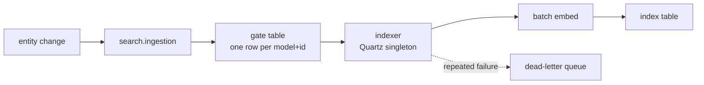

# SQLite-backed semantic search

*As of 2026-09-18 — voytek*

A SQLite semantic index is feasible, and cheaper than it looks: production already defaults to an exact
brute-force scan, SQLite with FTS5 already ships in every Metabase, and the vector store's real job is
denormalized SQL that SQLite can do unaided. The harder half of "available with no additional effort" is the
embedder, not the store — the only zero-config provider does not run on Metabase's default Alpine image.

---

## What semantic search is

Keyword search matches words. Semantic search matches meaning: "revenue by cohort" should find a question
called "Monthly recurring revenue per signup month", even though the two share no words.

Three ideas carry it.

**Embeddings.** A model maps text to a fixed-length list of numbers — a vector — trained so that related texts
land near each other. Each model defines its own coordinate system, so vectors from two different models are
not comparable even when they have the same length.

**Similarity is geometry.** "Nearest" is usually cosine distance, which compares the direction two vectors
point. Retrieval is then: embed the query, find the stored vectors closest to it.

**Finding the nearest ones.** An exact search compares the query against every eligible vector. An approximate
index (ANN — HNSW is the common one) navigates a graph instead and visits far fewer, trading some recall for
speed.

In practice nobody ships vector search alone. Semantic retrieval is weak exactly where keyword search is strong
— exact names, IDs, rare tokens — so production systems run both arms and fuse the two ranked lists, usually
with Reciprocal Rank Fusion. The application then applies its own filters, permissions and business ranking on
top.

Two costs shape every design. Embedding is a model call, so it happens in the background rather than in the
request. And the index is a second copy of your data, so it can go stale and has to be maintained.

---

## How it works today

Three jobs — encode, store, retrieve — and the store's job is much bigger than "hold vectors".

**Encode.** `src/metabase/embeddings/provider.clj` is a real SPI: a registry of
`{:resolve-model :readiness :embed-texts :prepare!}` implementations keyed by provider name, pinned to an
`embedding-spi-version`. The concept that matters is `embedding-space-id` — a SHA-256 over provider, model
name, dimensions, revision, and (for the in-process provider) the architecture-specific ONNX export digest.
Vectors are comparable only within one space, and the whole index lifecycle turns on that hinge. Providers:
`ai-service` (default), `openai`, `ollama`, and `in-process`.

**Store.** One wide table per embedding space (`index.clj:55`). Not a vector sidecar — about 30 columns: filter
columns (`archived`, `collection_id`, `personal_owner_id`, `creator_id`, `database_id`, `display_type`,
`verified`, `curated`), scoring columns (`view_count`, `dashboardcard_count`, `last_viewed_at`,
`model_updated_at`), two weighted `tsvector` columns (with and without native query text), `legacy_input`
jsonb, and `embedding vector(D)`. It is a self-sufficient denormalized copy of the searchable corpus.

**Retrieve.** Four strategies (`index.clj:718-793`): `hnsw` (post-filter), two `hnsw-iterative-*`, and
`brute-force`. **Production defaults to `brute-force`** (`settings.clj:149`) — filter-first, exact, inside a
`MATERIALIZED` CTE that fences the planner off the HNSW index. Since the Stats incident, Metabase in practice
runs an exact scan over every filtered row, capped at 1000 candidates. That single fact does more for the
SQLite case than anything else in this document.

| To understand | Read |
| --- | --- |
| Models, providers, settings, defaults | `semantic_search/settings.clj`, `embedding.clj` |
| Vector queries, filtering, hybrid ranking | `semantic_search/index.clj` |
| Fallback, supplementation, metrics | `semantic_search/core.clj` |
| Background indexing and repair | `gate.clj`, `indexer.clj`, `repair.clj`, `dlq.clj` |
| Where vectors are stored | `semantic_search/db/datasource.clj` |
| Index compatibility and migrations | `index_metadata.clj`, `db/migration.clj` |
| Engine selection and ingestion | `src/metabase/search/engine.clj`, `search/ingestion.clj` |
| In-process embedder plugin | `modules/embedder/` |

---

## The two paths

### Writing: gated and asynchronous

Four ideas here are worth keeping whatever the datastore. The gate **collapses**: one row per `(model, id)`,
keyed `"card_123"`, so ten edits to a card cost one embedding, not ten — this is what makes embedding spend
tractable. The indexer keeps a **watermark** in the metadata table, so a crashed node resumes rather than
restarts. A **dead-letter queue** plus a stall detector means one poisoned document cannot stall the pipeline.
And an hourly **repair** pass reconciles the index against the canonical document stream and finds lost
deletes. The gate is documented as heuristic: it reduces how often you need a full reindex, it does not
guarantee convergence.

### Reading: one SQL statement, then Clojure

`index.clj:1178`. Embed the query (with the model's `query:` prefix) while concurrently warming the connection
pool, which holds zero idle connections by default so a shared RDS stays viable. Then **one** statement carries
the vector CTE, the `tsvector` keyword CTE, a `FULL JOIN` between them, RRF blending (`k=60`, 0.49 semantic /
0.51 keyword), about twelve scorer expressions, and `ORDER BY total_score DESC`.

Afterwards, in Clojure: permission filtering, collection-descendant filtering, then a second batch of scorers
that need appdb tables (`user-recency`, bookmarks). Then the fallbacks — under 100 surviving results
**supplements** with appdb search results scored at `semantic-distance = 0`; a thrown statement **discards** the
whole semantic attempt and returns appdb search.

The architectural point: scoring is already split across two engines. In-store scorers run as SQL in the vector
store, appdb scorers run in memory afterwards. Any new store inherits that split for free.

---

## Where it can run today

`db/datasource.clj` resolves a `pgvector-mode`:

| Mode | Condition |
| --- | --- |
| `dedicated` | `MB_PGVECTOR_DB_URL` is set. Always wins. |
| `app-db` | App DB is Postgres, and the `vector` extension is installed or the app-db role can `CREATE EXTENSION`. Tables isolated in a `semantic_search` schema. |
| `unavailable` | Everything else. |

The provisioning check is worth noting: it verifies `CREATE EXTENSION` inside a rolled-back transaction rather
than reading `pg_available_extensions`, because managed Postgres routinely lists the extension as available
while denying the DDL.

So the eligible population is Postgres app DBs with pgvector, or a second Postgres you provision — plus the
`:semantic-search` premium feature, plus a working embedding provider (`supported?` in `core.clj` deliberately
gates engine selection on a usable embedder).

H2 and MySQL/MariaDB instances get nothing. And the neighbouring gap is worse than it looks:
`search/appdb/core.clj:43` sets `supported-db?` to `#{:postgres :h2}`, so **MySQL/MariaDB app DBs have no
keyword full-text search either** — they fall through to the `in-place` engine, which is LIKE-matching over the
app DB.

---

## What a SQLite store would have to replace

Not "store vectors". The pgvector store owns seven jobs, and a proposal has to say what happens to each:

1. Hold the denormalized document row, about 30 columns.
2. kNN over vectors with a distance cutoff (0.7 cosine).
3. Full-text ranking (`ts_rank_cd` over two weighted `tsvector` columns).
4. RRF fusion of the vector and keyword arms.
5. About twelve scorer expressions plus ordering, in SQL.
6. Structural filters pushed into the scan — archived, models, creator, collection, dates.
7. The maintenance substrate: gate table, watermarks, DLQ, repair table.

SQLite can do 1 through 6 natively, with no extension. Item 7 is the part you should deliberately not build
during a hackathon.

---

## What is already in your favour

This is a much better starting position than it looks.

| Asset | Where | Why it matters |
| --- | --- | --- |
| `org.xerial/sqlite-jdbc 3.50.3.0` already in core deps | `deps.edn:185` | Ships in every Metabase today, because the bundled Sample Database runs on SQLite. No new distribution risk. |
| xerial's bundled natives compile in FTS5 and JSON1, and include a Linux-Alpine/musl build | upstream | The keyword arm and the JSON columns come free, on the default Alpine image. `bm25()` is built in, so RRF works unchanged. |
| Production already defaults to `brute-force` | `settings.clj:149` | You are not replicating HNSW. You are replicating an exact scan. Dramatically easier target. |
| Scoring already splits store-side and appdb-side | `scoring.clj` | Precedent for computing part of the score outside the vector store. |
| Permission filtering already happens in Clojure | `index.clj:980-1046` | Unchanged by the datastore. |
| Dialect-parameterised scoring helpers and an appdb specialization layer | `search/appdb/specialization/` | An existing seam for adding a `:sqlite` specialization. |
| In-process embedder exists | `modules/embedder/` | 384-dim local model, no network, no API key. |

One underrated consequence worth putting in the pitch: a SQLite mirror index gives **MySQL/MariaDB app-DB
instances full-text search they do not have today**. The same artifact upgrades that population twice — from
LIKE-matching to BM25, and from nothing to semantic. That is a bigger story than "same feature, easier deploy".

---

## The three design decisions

### A. Where does the durable copy of the vectors live?

This matters most, and it is not really about SQLite.

A SQLite file is node-local. Metabase runs multi-node against a shared app DB, and the indexer is a Quartz
cluster singleton. If each node keeps its own file you either re-embed the corpus per node — N times the spend
and N times the API calls — or you ship files between nodes, which is a new failure mode.

The clean answer: **the app DB holds the durable embeddings in a BLOB column, and SQLite is a node-local
materialized read replica that any node can rebuild without calling the model.** That buys you four things at
once. Embedding is paid once, cluster-wide, coordinated by the existing singleton indexer. Vectors ride app-DB
backups and snapshots, where today the semantic index sits outside the snapshot entirely. The SQLite file
becomes a pure cache, so losing it is a rebuild rather than data loss, which makes read-only and ephemeral
containers fine. And it works on H2, MySQL and Postgres app DBs — precisely the "wider spectrum" goal.

Framed that way, the headline of the project is arguably **vectors in the app DB, retrieval node-local**, and
SQLite is the choice of local retrieval engine because it brings FTS5, SQL filtering and persistence with it.

### B. Extension, or no extension?

| Option | Status | Verdict |
| --- | --- | --- |
| **No extension**: `embedding BLOB` plus a cosine scan in the JVM | — | **Start here.** Matches today's `brute-force` default exactly. Zero native-distribution risk. |
| `sqlite-vec` `vec0` | Pre-1.0 alpha (0.1.10-alpha.x); breaking SQL and storage changes expected; float/int8/binary; rescore, IVF and DiskANN landing | Alpha, plus you must ship natives for roughly six platform triples, plus xerial has no clean extension-loading API — you would enable `load_extension` (a SQL-injection surface) or patch in the C API. |
| `vec1` from sqlite.org | v0.7, "no further features required before a 1.0 release"; single portable C file, no dependencies, AVX2/NEON; IVFADC with OPQ | The more promising long-term bet, but source-distributed, so the same build-and-ship-natives problem and the same JDBC loading problem. |
| Pure-JVM ANN (Lucene HNSW, JVector) | Mature, pure Java | The escape hatch if brute force stops scaling. A new dependency, but no native story. |

### C. How much of the query moves into SQLite?

Two shapes. **Split** — SQLite does kNN only, hands back an id list, the app DB does filtering, FTS and
scoring. Reject this: you lose filter-first and land back in the post-filter under-fetch problem the Stats
postmortem was about.

**Mirror** — replicate the full index row into SQLite: filter columns, an FTS5 virtual table, `legacy_input` as
JSON, `embedding` as BLOB. The whole hybrid query is then one SQLite statement, exactly as today, and the
result is a drop-in `search.engine` implementation. Take this one.

For the scan itself, a SQLite user-defined function (`Function.create` in xerial) computing cosine over the
BLOB keeps filter-first semantics in SQL: `WHERE <filters> ORDER BY cosine_distance(embedding, ?)`. That is a
direct structural analogue of the `MATERIALIZED` CTE trick.

---

## Does an exact scan scale?

Do the arithmetic before assuming you need ANN. Per query the scan is `N × D` multiply-adds, and it is
memory-bandwidth-bound, so bytes touched is the number to reason about.

| Corpus | 1024-d float32 | 384-d float32 | 384-d int8 |
| --- | --- | --- | --- |
| 20k docs | 80 MB | 30 MB | 7.5 MB |
| 100k docs | 400 MB | 150 MB | 38 MB |
| 500k docs | 2 GB | 750 MB | 190 MB |

At 384-d int8, a 100k-document instance touches about 38 MB per query — single-digit milliseconds off a warm
mmap, and it fits comfortably in RAM. The 1024-d float32 at 500k cell is where you reach for quantization or
ANN.

So a 384-dimension model plus int8 quantization plus an exact scan probably covers the large majority of
self-hosted instances, with better recall than the HNSW path Stats was running.

The failure mode to watch is the corpus mix. `search.config/all-models` covers 13 models, and two of them —
`table` and `indexed-entity` — can run to six figures on large warehouses. Get a real document count and size
distribution from a big instance before committing; that single number decides brute-force versus ANN and
1024-d versus 384-d.

---

## The problems, ranked

**1. The embedder is the actual deployment blocker, not the store.** The default provider is `ai-service`;
`openai` needs a key; `ollama` needs a sidecar. The one zero-config option, `in-process`, **does not run on
Metabase's default Alpine image** — `bin/docker/Dockerfile` is `eclipse-temurin:25-jre-alpine`, and
`modules/embedder/.../catalog.clj` fails readiness on musl because the pinned DJL tokenizer native is not
musl-compatible. It does not run on Intel macOS either. If the pitch is "no additional effort", a SQLite store
alone does not deliver it. Either get the tokenizer native building against musl, make the Ubuntu image the
default for this feature, or ship a pure-JVM tokenizer. Critical path, not a footnote.

**2. Node-local versus cluster-shared.** Resolved by decision A, but resolve it explicitly on day one, not day
four.

**3. Rewriting the SQL surface.** `tsvector`/`ts_rank_cd` becomes FTS5 and `bm25()`; `jsonb` becomes
`json_extract`; `clock_timestamp()` has no equivalent; `percentile_cont`, used by the view-count scorer, has no
equivalent either. `ON CONFLICT` is fine, advisory locks are unnecessary locally. Mechanical, but it is the
bulk of the work.

**4. Recall parity must be measured, not assumed.** FTS5 and `bm25()` rank differently from weighted
`ts_rank_cd`, which changes the keyword arm's ordering, which feeds RRF. You can land identical vectors and
still get visibly different results. `dev/src/dev/semantic_search/recall.clj` already does the right
measurement — nn-recall and score-recall against an exhaustive ground truth — so point it at both engines on
the same corpus.

**5. Where does the file live?** It needs a writable path in a container. Since it is a cache, a `/tmp`
fallback with rebuild-on-boot is acceptable, but boot-time rebuild cost at 100k documents is non-trivial even
without re-embedding.

**6. Licensing and packaging.** `:semantic-search` is a premium feature and all the code sits under
`metabase_enterprise/`. "Wider spectrum of instances" may mean OSS, which is a product decision with
module-boundary consequences. Settle it before moving namespaces.

---

## Alternatives to the solution

The goal decomposes into two independent blockers, and SQLite only addresses the first:

1. A retrieval engine that ships in-process — no pgvector, no second database, no sidecar.
2. An embedder that works with no configuration — no API key, no network, no separately-installed plugin.

Blocker 1 is already close to solved by accident: production defaults to `brute-force`, so the engine being
replaced is an exact scan. Blocker 2 is genuinely open. **An alternative that attacks the embedder buys more of
the goal than any choice of datastore.**

### Engines for blocker 1

| Option | Native code? | Gives you | Cost |
| --- | --- | --- | --- |
| **Apache Lucene** | None — pure Java | BM25 and HNSW kNN in one index, filters the kNN respects, int8/int4/binary quantization | ~15 MB dep; scorers move from SQL to Clojure; segment files are node-local; format upgrades between majors |
| **SQLite + FTS5, vectors as BLOB** | Already shipped | FTS5/BM25, SQL filters, HoneySQL ports directly | Vector scan via a JDBC UDF is the slow path; ANN needs a native extension |
| **App DB + in-JVM scan** | None | Works on H2/MySQL/Postgres today, rides backups, zero new deps | No FTS5, so MySQL still has no keyword arm |
| **JVector / hnswlib-java** | None | Pure-Java ANN, small | Vectors only, no lexical arm |
| **DuckDB + vss** | Yes, fat jar | Columnar, good SQL | `vss` is experimental, musl story unclear — strictly worse shippability than SQLite |

Lucene is the serious alternative, and on shippability it beats SQLite: zero native code, so Alpine, musl and
arm64 are non-issues, and ANN comes free the day brute force stops scaling — exactly what SQLite cannot give
without a native extension. The price is that it is not SQL, so the scorer expressions in the hybrid statement
move into Clojure. `scoring.clj` already runs a second batch of scorers in memory, so the pattern exists.

There is also a split nobody frames as an option: SQLite for metadata, FTS5 and filters, with vectors in an
off-heap array scanned in a tight Java loop. Both halves are already free, and it avoids SQLite's one real
weakness — per-row JNI round-trips through a UDF.

### Embedders for blocker 2

- **Fix the musl gap.** Alpine has an `onnxruntime` community package, so it is buildable, but you own the
  build pipeline, and the DJL HuggingFace tokenizer native is the other half. Real work, no product story.
- **Ship the Ubuntu image for this feature.** Cheapest, and pushes effort back onto the operator — the thing
  you are trying to remove.
- **Static embeddings — no transformer inference at all.** [Model2Vec / `potion-*`](https://github.com/MinishLab/model2vec)
  models are a token-embedding lookup table plus pooling: no ONNX, no matrix multiplication, no native code.
  [`potion-base-32M`](https://huggingface.co/minishlab/potion-base-32M) reaches roughly 92–95% of
  `all-MiniLM-L6-v2`'s MTEB average at hundreds of times the speed, in a few MB. A pure-Java implementation is
  about a day's work; the only non-trivial part is a WordPiece tokenizer.

The third is the one to push. It turns "semantic search needs infrastructure" into "semantic search is a jar",
and it composes with what exists: another `metabase.embeddings.provider` implementation with its own
`embedding_space_id`, so an instance can start on static embeddings and later switch to `ai-service` or the
ONNX plugin, with the existing multi-index switchover handling the migration.

**Caveat, stated openly:** that 92–95% is an MTEB *average*, and retrieval is static models' weakest category.
Metabase runs `arctic-embed-l-v2.0`, well above MiniLM. So this is a lower quality tier, not parity. But the
comparison is not against arctic — it is against nothing, or against LIKE-matching on MySQL instances.

### The option that makes the engine question mostly disappear

Binary-quantize. 1024 dimensions at one bit each is 128 bytes per document, so 100k documents is **12.8 MB** —
a heap `byte[]`, Hamming distance via `Long.bitCount`, then rerank the top ~1000 against float vectors pulled
from the app DB. Arctic's Matryoshka support also allows truncating to 256 dimensions first.

At that size you do not need an embeddable engine at all — you need an array and a boot-time load. Zero
dependencies, every app DB type, rebuilds in seconds. Worth benchmarking first, because if it holds it makes
both SQLite and Lucene optional rather than load-bearing.

---

## A week-shaped plan

**Day 1 — decide and measure.** Settle decision A (app-DB durable, SQLite replica). Get a real document count
and size distribution from a large instance. Confirm the embedder situation on Alpine.

**Days 2–3 — build two stacks, not one.** Reuse `search.ingestion/searchable-documents` and the existing
provider SPI verbatim for both. Skip the gate, DLQ and watermark machinery entirely — a full rebuild from the
app DB is fine for a demo and keeps you out of the hardest code.

- *Store:* a new `search.engine` implementation with a SQLite mirror — metadata columns, an FTS5 virtual table,
  `embedding BLOB`, a `cosine_distance` UDF, WAL mode, and a filter-first hybrid query with `bm25()` plus RRF.
  Benchmark the binary-quantized in-memory variant alongside it; if that holds, say so.
- *Embedder:* a pure-Java static-embedding provider (Model2Vec `potion-*`) registered on
  `metabase.embeddings.provider`. A day's work, and it is what removes the Alpine blocker.

**Day 4 — parity, on two axes.** Run `dev.semantic-search.recall` over one corpus against three stacks:
pgvector with arctic (baseline), the local store with arctic, and the local store with static embeddings. That
separates *what leaving Postgres costs* from *what leaving the transformer costs*. Report nn-recall,
score-recall, and p50/p95 latency at your real N. This is the artifact that decides whether the idea survives.

**Day 5 — the interesting bit.** The topic note hopes a compact index sparks ideas beyond search. The honest
generalization is *a node-local, zero-infrastructure embedding index with a stable `embedding_space_id`
contract*: Metabot context retrieval, Library retrieval (already a consumer of the same embedder), transform
and dependency similarity, "find similar questions", duplicate detection. Worth a slide even unbuilt — a small
demo of a second consumer on the same store is what turns this from "cheaper semantic search" into "Metabase
has a local retrieval primitive".

**Explicitly out of scope for the week:** building an ANN index, the gate/DLQ/repair pipeline, multi-index
switchover, and any native extension. Lucene stays on the table as the follow-up if the parity numbers say
brute force will not hold.

### Open questions

- [ ] Actual document counts on the largest instances — decides brute-force versus ANN and 1024-d versus 384-d.
- [ ] Does a static embedder clear the quality bar on Metabase's own corpus, or is the musl fix unavoidable?
- [ ] SQLite or Lucene as the local engine — answerable only once the day-4 numbers exist.
- [ ] Is OSS in scope, or does this stay behind `:semantic-search`?

---

## Sources

Metabase internals in this document were read from the `sqlite-semantic-search` worktree on 18 September 2026;
file and line references point there.

- [Semantic search at Metabase: a reading companion](https://linear.app/metabase/document/semantic-search-at-metabase-a-reading-companion-436c0ac94c57)
  — Andrei Simionescu's primer, checked against the code on 11 August 2026
- [sqlite-vec](https://github.com/asg017/sqlite-vec) — release status and `vec0` capabilities
- [vec1](https://sqlite.org/vec1) — the sqlite.org vector extension: version, IVFADC/OPQ, distribution
- [xerial/sqlite-jdbc](https://github.com/xerial/sqlite-jdbc) — bundled natives, FTS5, Alpine/musl build
- [xerial/sqlite-jdbc#1212](https://github.com/xerial/sqlite-jdbc/issues/1212) — integrating the sqlite-vec extension through JDBC
- [Model2Vec](https://github.com/MinishLab/model2vec) and [potion-base-32M](https://huggingface.co/minishlab/potion-base-32M) — static embeddings, MTEB comparison
- [Snowflake Arctic Embed L v2 model card](https://huggingface.co/Snowflake/snowflake-arctic-embed-l-v2.0) — dimensions, normalization, query prefix
- [pgvector HNSW documentation](https://github.com/pgvector/pgvector#hnsw) — build parameters, filtering, iterative scans, vacuum
