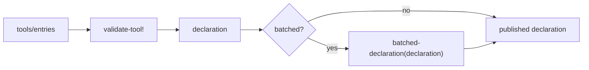
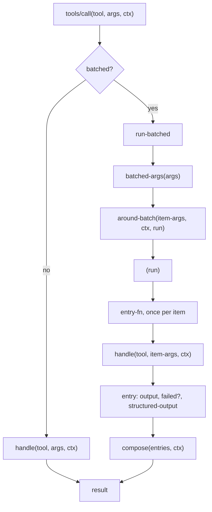

# Metabot tool definitions

This document refines the approach in **"Metabot tool layer: technical design"**. Read that document first. This one assumes its error model: the three error classes, `defrecoverable`, `unrecoverable!`, the converters, and the rule that only authored text reaches the agent or the user.

The error model held up in implementation. The tool definition did not. The problems were almost all in one area: tools that do one thing per item. This document replaces `deftool` with a record and two protocols, and gives batched tools a model that the original design did not have.

Tools are converted one at a time. A tool written against the old shape is wrapped in an adapter that implements the new protocol, so a profile can hold both kinds and nothing has to change on a single day. Section 5 describes this.

---

## 1. What this refines

| Original design | This document | Why |
|---|---|---|
| `deftool` macro; options in one map | A record implementing `Tool` | Several tools are the same tool under different configuration. A map of options cannot say that. |
| No model for batched tools | `BatchedTool` protocol | The original design asked whether declared errors can be rendered inside a successful result. They can. This is the model. |
| `:needs #{:memory}` gates the memory atom | `ctx` always carries it | A per-tool allowlist only made the memory accessors return `nil` for anyone who forgot to add their tool. |
| Strict-client checks run on `:args` | They do not | `search`, `construct` and `create_alert` fail that check today, and the adapters never apply the strict transform it exists for. |
| `:output` is a string | `:output` is a renderable | MCP renders prose at the boundary. A renderable lets one tool concept serve either consumer later. A string is a renderable, so tool code does not change. |
| Declaration keys are flat | Neutral core, namespaced extras | Same reason. A consumer reads its own namespace. |
| `::handler-result` | `::result`, used for a whole call and for one item | One shape, not two. |
| All tools convert in one change | A tool converts on its own | A var carrying old-shape metadata is wrapped in a record implementing `Tool`. There is no flag day and no legacy path in the runtime. |

Everything else in the original design is unchanged.

---

## 2. The shape

A tool is a record. It implements `Tool`:

```clojure
(defprotocol Tool
  (declaration [this])        ; what the tool is
  (handle [this args ctx]))   ; one unit of work
```

A tool that can also take several items at once adds `BatchedTool`:

```clojure
(defprotocol BatchedTool
  (batched-declaration [this declaration])       ; the single one in, a complete batched one out
  (batched-args        [this args])              ; batched args -> one args map per item
  (around-batch        [this item-args ctx run]) ; wrap the whole run
  (compose             [this entries ctx]))      ; the result for the whole call
```

`Tool` stays the single-item tool. Take `BatchedTool` away and the record still works. It reads one URI, loads one id, edits one query. So `handle` **is** the item loader. There is no second per-item function to keep in step with it.

A consumer calls one function:

```clojure
(tools/call tool args ctx)
```

`call` makes the single-or-batched decision. No consumer branches, and no consumer repeats the orchestration.

---

## 3. Call flow

### 3.1 At declaration time

A consumer publishes the batched declaration when there is one. A batched tool is offered to the model in its batched form only. The single form exists so that `handle` is a real tool.



Both declarations are checked at load time. A batched `:args` that the tool composed wrongly fails then, not on the first model call.

### 3.2 At call time



`around-batch` wraps everything inside it, including `compose`. `(with-cache (run))` is a whole implementation.

`entry` renders each item's `:output` to a string, so `compose` never handles a renderable. The consumer renders whatever `compose` finally returns. See section 4.4.

### 3.3 Where a thrown error goes

| Thrown in | Single-item call | Batched call |
|---|---|---|
| `handle`, declared recoverable | the call fails; the runtime renders it | becomes that item's entry; the call succeeds |
| `handle`, anything else | the call fails | the whole call fails; items that loaded are discarded |
| `handle`, `unrecoverable!` | the call fails; the turn ends | the whole call fails; the turn ends |
| `around-batch` | n/a | the whole call fails |
| `batched-args` or `compose` | n/a | the whole call fails |

An undeclared exception discards the items that loaded. This is deliberate. A bug is not a partial result.

---

## 4. Why a record, not a macro

### 4.1 Protocols give real extension points

The macro put every option in one map. To add a capability you add a key, and the framework tests for that key. The test is `contains?`, so a typo reads as "this tool does not want the capability".

A protocol is a type test. A tool either implements `BatchedTool` or it does not. Clojure can see the difference. A reader can see the difference.

### 4.2 Configuration becomes data, not a copy

Four tools in the codebase are the same tool. `search`, `sql_search`, `nlq_search` and `transform_search` share:

- the same scope (`agent-search`)
- the same title function (`search-display`)
- the same body: `(do-search label allowed-types opts args)`

They differ in five values: name, description, argument schema, allowed entity types, and an options map.

Today that is four `mu/defn` forms with four copies of the same metadata. A reader must compare them to find out that they match. The original design keeps that shape; it only changes the macro.

With a record it is one type and four instances. What varies is in the constructor call. What is shared is in the record.

The description also stops being a docstring. All four tools hardcode their description today because a docstring cannot be computed.

### 4.3 Batched tools get a model

The original design has no model for a tool that does one thing per item. It asks the question and leaves it open: can a declared error be rendered inside a successful result?

Some tools need this. `read_resource` takes up to 5 URIs. `load_skill` takes a list of skill ids. `list_available_fields` takes three lists of ids. Each one has a hand-written blanket catch today:

```clojure
(catch Exception e {:uri uri :error (ex-message e)})
```

That forwards any exception message to the model. It is the main thing the original design's text rule exists to stop, and it is in two tools today.

These tools are plural for two unrelated reasons:

1. Latency. The agent asks for several things in one call.
2. Database load. The loader wants to read many rows at once.

This design separates them:

- The unit of partial failure is the **agent's request item**. It is the only unit.
- Batching is a **wrapper** around the whole run. It takes no part in per-item control flow.

Because each item is handled on its own, `handle` can throw. A batch loader cannot: it must report several failures at once, and an error constructor throws only one.

For everything that differs between the single and the batched form, `BatchedTool` has a `batched-...` function. It receives the single form and returns a **complete** batched form. The framework derives nothing, so there are no special cases and no shape a tool cannot express. Two things differ in practice — the argument schema and the description — and both are in the declaration, so one pair of functions covers both.

This matters for the wire format. A framework that wrapped the single `{:uri :string}` schema would publish `[{"uri": "a"}]`. `read_resource` publishes `["a"]`. The tool composes the batched schema, so nothing changes.

### 4.4 A consumer can be layered on

MCP v2 has its own tool definition. These tool sets should stay separate: their `search` tools have different arguments, modes, projections and paging.

But a tool can be **one concept** that either consumer uses. Three things make this work.

**Text is a renderable, not a string.** MCP builds prose as message records and renders them at the boundary. It does this for locale and to keep untrusted text separate. Metabot uses plain English strings.

```clojure
(defprotocol Renderable
  (render-text [this]))

(extend-protocol Renderable
  String
  (render-text [this] this))
```

`:output` holds a renderable. A string is one, so every example in this document is already correct, and a Metabot tool author writes strings and never thinks about this. The protocol exists so that a consumer with its own text model does not force a change in tool code:

```clojure
;; a tool written for a consumer that renders late
(handle [_ {:keys [term]} _ctx]
  {:output (message/msg ["No glossary entry for %s."] term)})
```

There are two render points, and both are outside the tool:

| Point | What it renders |
|---|---|
| `entry`, per item | that item's `:output`, so a composer always receives strings |
| the consumer, at the end | the final `:output`, whatever the tool or the composer returned |

`render-text` is deliberately not satisfied by every object. A result whose `:output` is a map or a keyword is a bug, and `::result` rejects it.

**The declaration has a neutral core and namespaced extras.** `:name`, `:description`, `:args` and `:scope` are neutral. Both consumers need all four. MCP tools already declare scopes from the same registry.

```clojure
{:name        "glossary"
 :description "Look up a business term."
 :args        [:map {:closed true} [:term {:optional true} [:maybe :string]]]
 :scope       scope/agent-content-read
 :metabot/title-fn (fn [{:keys [term]}] (or term "all terms"))
 :mcp/annotations  {:readOnlyHint true :idempotentHint true}}
```

A consumer reads its own namespace. It uses its own defaults for the rest.

The declaration map is therefore open. The original design closes its options map to catch typos. This design keeps that protection with a different rule: every key outside the neutral core must be namespaced. `:capability` is rejected. `:metabot/capabilities` is not. A misspelling inside a namespace belongs to that consumer, which is the only thing that knows its own keys.

**An error is data.** Each consumer maps a `ToolError` to its own wire format. On MCP every class becomes `isError` content with a JSON-RPC code, because MCP has no turn for `:unrecoverable` to end.

Nothing in MCP must change for this. The work keeps the option open.

### 4.5 Consumers get simpler

`tools/call` holds the single-or-batched test. The runtime calls it and never asks what kind of tool it has. `tools/run-batched` and `tools/batched?` stay public for a consumer that needs them for its own reasons.

A consumer with a different error vocabulary passes its own per-item function:

```clojure
(tools/call tool args ctx entry-fn)
```

`entry-fn` turns one item's arguments into an entry. Rendering a recoverable error to text is neutral. What a consumer does with an unrecoverable one is not.

---

## 5. Converted and unconverted tools together

A tool used to be an `mu/defn` var with `:tool-name`, `:schema` and friends in its metadata. It took one argument, returned a loose result, and signalled errors with `:agent-error?` or `:terminal-error?`.

`metabase.metabot.tools.legacy` wraps such a var in a record that implements `Tool`:

```clojure
(defrecord LegacyTool [tool-var]
  tools/Tool
  (declaration [_] ...from the var's metadata...)
  (handle [_ args _ctx] ...call it, adapt what comes back...))
```

A profile's tool list goes through `adapt-all` once. Converted and unconverted tools then arrive at `tools/entries` as the same kind of thing:

```clojure
(tools/entries
 (tools.legacy/adapt-all [#'tools/search-tool     ; not converted yet
                          read-resource-tool]))   ; converted
```

`adapt` returns a tool that already implements `Tool` unchanged, so the list can be mixed and each conversion changes only that tool's entry.

Nothing in the runtime knows the difference. There is no second code path to keep working, and no tool is blocked on another tool's conversion.

### 5.1 Why a wrapper and not `extend-protocol`

Extending `Tool` to `clojure.lang.Var` is shorter and does not need `adapt-all` at all. It is wrong for two reasons.

Every var in the codebase would satisfy `Tool`. `(satisfies? Tool #'clojure.core/map)` returns true, so the predicate stops meaning anything — for us and for any other consumer that asks.

And a var passed in by mistake fails late. The only place that could notice is `declaration`, which runs well after registration. `adapt` refuses it by name, where it was registered:

```
#'clojure.core/map is not a tool: its var carries no :tool-name metadata
```

The same check answers the other direction: `legacy-tool?` says whether a var carries old-shape metadata, without wrapping it.

### 5.2 What the adapter maps

| Old shape | New shape |
|---|---|
| `:tool-name` metadata | `:name` |
| docstring, with the `Inputs:` / `Return:` preamble `mu/defn` adds | `:description`, stripped |
| `:schema`, an `[:=> [:cat args] out]` | `:args` |
| `:capabilities`, `:title-fn`, `:prompt`, `:system-instructions` | `:metabot/...` |
| a returned string, keyword or number | `{:output "..."}` |
| `:structured_output` | `:structured-output` |
| `:instructions` | appended to `:output` |
| `:status-code` on a result | dropped |
| a thrown `:agent-error?` | one declared recoverable error carrying the message |
| a thrown or returned `:terminal-error?` | `unrecoverable!`, with the text as `:user-message` |
| anything else thrown | passes through, so it is unrecoverable |

The `:agent-error?` flag is the author saying the sentence was written for a model. That is the same judgement `with-pipeline-errors` makes, so the message is authored text and may be relayed. One declaration covers all of them: an unconverted tool has not said which error it raised.

### 5.3 What the adapter does not fix

Behaviour is preserved, not improved. An unconverted tool that catches its own error and returns the message as `:output` still looks like a success:

```clojure
{:output "Failed to read the card."}
```

Nothing in the adapter can tell that string from a real result. Converting the tool is what fixes it. The same applies to blanket `catch` blocks: they keep forwarding exception messages to the model until the tool is converted.

Unconverted tools do get the new checks, because those come from the declaration: argument validation, the scope check, and the result shape.

### 5.4 When the adapter goes away

`metabase.metabot.tools.legacy` and `metabase.metabot.tools.recoverable.legacy` are deleted when the last tool is converted. The `adapt-all` call goes with them. The description strip moves out of the adapters at the same time, because a converted tool's description needs none.

---

## 6. Benefits and costs

### 6.1 Where things move

| Concern | Today | Proposed |
|---|---|---|
| Tool definition | `mu/defn` + var metadata | record + `Tool` protocol |
| Tool variants | duplicate `defn` forms | instances of one record |
| Error shaping | `try` + `handle-agent-error` in each tool | declared errors; the runtime renders |
| Error text for the model | built in the tool | built in the runtime |
| Partial failure | blanket `catch` in the tool | `BatchedTool` + declared errors |
| Batched argument shape | written by hand | `batched-declaration`, composed by the tool |
| Item count limit | hand-written check in the tool | the batched `:args` schema |
| Model-facing description | Clojure docstring | `:description` field |
| Declaration extras | flat keys | namespaced per consumer |
| Result text | string | renderable; rendered by the consumer, not the tool |
| Scope check | wrapper function in `tools.clj` | the runtime, from the declaration |
| Agent state | dynamic var | `ctx` |

### 6.2 Benefits

| Benefit | Evidence |
|---|---|
| Tool variants stop being copies | 4 search tools become 1 record and 4 instances |
| Batched tools have a model | two blanket catches become declared errors |
| A batched tool's single form is testable | `(handle tool {:uri "..."} ctx)` with no batching |
| An item result is a complete result | `:output` is required, as for any tool |
| The wire format does not change | the tool composes the batched schema |
| Consumers do not branch | `tools/call` holds the one test |
| A test double is a value | `reify Tool` with two methods |
| One text function for both audiences | a failed item reads like a failed call |
| MCP can use a tool later | neutral core, namespaced extras, renderable output |
| No flag day | an unconverted var is wrapped; a profile holds both kinds |

### 6.3 Costs

| Cost | Detail |
|---|---|
| Conversion effort | ~40 tools change shape, one at a time. The macro was a mechanical swap; this is not. |
| An adapter exists for a while | Two namespaces and one declared error live until the last tool is converted. |
| Profiles change | `#'tools/search-tool` becomes an instance. |
| `declaration` repeats | A literal map per tool. More characters, by choice. |
| No docstring for the model | `clojure.repl/doc` on a tool gives the record type. |
| Protocols have no defaults | Each `BatchedTool` writes `(around-batch [_ _ _ run] (run))` and `(compose [_ es _] (concatenated es))`. |
| Two schemas per batched tool | Share the item schema through a var so they cannot drift. |
| Composers own multi-line text | An entry's `:output` is multi-line when its failure keeps a recovery step. |
| Item limit messages get worse | See section 8. |
| Argument repair code is duplicated | The runtime and `self.core` both hold it until tools are converted. |

### 6.4 How the modeling changes

**The agent's request item is the only unit of partial failure.** A tool that fans out internally — `search` runs several queries and merges them — is a single-item tool. What it does inside the call is its own business. It returns a result or it throws. There is no partial failure to model.

**Sub-item failures belong to the item loader.** `read_resource` on `metabase://database/1/tables` is one item. If part of that listing is incomplete, the item says so in its own output.

**Composition decides where a failure appears.** A tool that formats per item puts failures in position. A tool that builds one document has no positions, so it puts them in a block.

---

## 7. Tool classes

Five classes. Each example is real code with internals stubbed.

### 7.1 Mutation tool

One action. Three failures, three audiences.

```clojure
(defrecord EditSqlQueryTool []
  tools/Tool
  (declaration [_]
    {:name        "edit_sql_query"
     :description "Edit an existing SQL query using structured edits."
     :scope       scope/agent-sql-edit
     :args        [:map {:closed true}
                   [:query_id [:or :string :int]]
                   [:old_string :string]
                   [:new_string :string]]
     :metabot/capabilities #{:permission-write-sql-queries}})
  (handle [_ {:keys [query_id old_string new_string]} ctx]
    (let [queries  (get-in @(:memory-atom ctx) [:state :queries])
          query-id (str query_id)
          query    (or (get queries query-id)
                       (unknown-query-id! {:query-id  query-id
                                           :available (vec (sort (keys queries)))}))]
      (when (no-native-perms? (:database query))
        (tools.error/unrecoverable!
         ::no-native-query-permission
         {:user-message (tru "You don''t have permission to write SQL against this database.")}))
      (let [new-sql (apply-edit (:sql query) old_string new_string)]
        (when-let [parse-error (validate-sql new-sql)]
          (sql-syntax-error! parse-error))
        {:output            (format-result query-id new-sql)
         :structured-output {:query-id query-id :query-content new-sql}}))))
```

Gone: the `try`, the `handle-agent-error` call, the `if valid?` branch that returned a success-shaped failure, and the `:instructions` key.

Results:

```
unknown query id  -> "Query q7 is not in this conversation. Available query ids: q1, q2."
                     {:class :recoverable}
bad syntax        -> {:class :recoverable :code ::sql-syntax-error}
no SQL permission -> "This call failed and the user was shown the error (...). Don't retry it."
                     {:class :unrecoverable :user-message "You don't have permission ..."}
```

### 7.2 Single-item tool

One call, one result. The result has one row or many. The cardinality does not matter.

```clojure
(defrecord GetTimelineDetailsTool []
  tools/Tool
  (declaration [_]
    {:name        "get_timeline_details"
     :description "Get the full details of a timeline including its events."
     :scope       scope/agent-timelines-read
     :args        [:map {:closed true} [:timeline_id pos-int?]]})
  (handle [_ {:keys [timeline_id]} _ctx]
    (let [timeline (tools/with-entity {:kind :timeline :id timeline_id}
                     (timeline/include-events-singular (timeline/get-timeline timeline_id)))]
      {:output (format "<timeline name=\"%s\">%s events</timeline>"
                       (:name timeline) (count (:events timeline)))})))
```

The whole tool is one converter. `with-entity` turns a 403 or a 404 into a declared error. Every other exception ends the turn.

`search` is also this class. It runs several queries and merges them into one list. That is internal.

### 7.3 Single-item tool with variants

One record. Four instances.

```clojure
(defrecord SearchTool [tool-name description args allowed-types opts]
  tools/Tool
  (declaration [this]
    {:name        (:tool-name this)
     :description (:description this)
     :args        (:args this)
     :scope       scope/agent-search              ; shared by all four
     :metabot/title-fn search-display})           ; shared by all four
  (handle [this args _ctx]
    (do-search (:tool-name this) (:allowed-types this) (:opts this) args)))

(def search-tool
  (->SearchTool "search" "Find tables, models, metrics, dashboards ..."
                search-args
                #{"dashboard" "document" "metric" "model" "question" "table"}
                {}))

(def nlq-search-tool
  (->SearchTool "search" "Find NLQ-queryable data sources ..."
                search-args
                #{"dashboard" "document" "metric" "model" "question" "table"}
                {:profile-id "nlq"}))

(def transform-search-tool
  (->SearchTool "search" "Find transforms, plus the tables and models around them."
                search-args
                #{"model" "table" "transform"}
                {:search-native-query true}))
```

The same pattern fits `create_sql_query`, whose two variants are one flag apart. It fits `construct_notebook_query` less well: its two variants have different schemas and different bodies.

### 7.4 Batched tool, ordinary composition

The single form is a complete tool. The batched form adds four short functions.

```clojure
(def ^:private skill-id-schema [:string {:description "A skill id."}])

(defrecord LoadSkillTool []
  tools/Tool
  (declaration [_]
    {:name        "load_skill"
     :description "Load the full instructions for one skill."
     :args        [:map {:closed true} [:id skill-id-schema]]})
  (handle [_ {:keys [id]} _ctx]
    {:output (skill-body id)})

  tools/BatchedTool
  (batched-declaration [_ declared]
    (-> declared
        (assoc :description "Load the full instructions for one or more skills.")
        (assoc :args [:map {:closed true} [:ids [:sequential {:min 1} skill-id-schema]]])))
  (batched-args  [_ {:keys [ids]}] (mapv (fn [id] {:id id}) ids))
  (around-batch  [_ _item-args _ctx run] (run))
  (compose       [_ entries _ctx] (tools/concatenated entries)))
```

`concatenated` joins the outputs in order. It collects the structured outputs into a vector. It concatenates the data parts. A failed item's text is in its own position.

The last two lines are the complete answer to Clojure's missing protocol defaults. Write the delegation out. A reader then sees what the tool does without another hop.

The item schema is in a var. Both declarations use it, so they cannot drift.

### 7.5 Batched tool, custom composition

`read_resource` needs its own composer for one reason. It emits a single title part built from the items that loaded. That key is not per-item.

```clojure
(defrecord ReadResourceTool []
  tools/Tool
  (declaration [_]
    {:name        "read_resource"
     :description "Read detailed information about one Metabase resource via its URI."
     :scope       scope/agent-resource-read
     :args        [:map {:closed true} [:uri uri-schema]]})
  (handle [_ {:keys [uri]} _ctx]
    (if-not (str/starts-with? uri "metabase://")
      (unreadable-uri! {:uri uri})
      (tools/with-entity {:kind :table :id (uri->id uri)}
        {:output            (format-table (fetch-table uri))
         :structured-output (fetch-table uri)})))

  tools/BatchedTool
  (batched-declaration [_ declared]
    (-> declared
        (assoc :description
               (str "Read detailed information about Metabase resources via URI patterns. "
                    "Up to " max-uris " URIs may be requested in one call."))
        (assoc :args [:map {:closed true}
                      [:uris [:sequential {:min 1 :max max-uris} uri-schema]]])))
  (batched-args [_ {:keys [uris]}] (mapv (fn [uri] {:uri uri}) uris))
  (around-batch [_ item-args _ctx run]
    (prefetch-tables! (map :uri item-args))
    (run))
  (compose [_ entries _ctx]
    (cond-> {:output (wrap-each-in-element entries)}
      (seq (remove :failed? entries))
      (assoc :data-parts [(title-part (remove :failed? entries))]))))
```

Output:

```
<resources>
<resource uri="metabase://table/1">
<table name="orders">id, total</table>
</resource>
<resource uri="nope">
"nope" is not a Metabase resource URI.
Call `search` and feed a URI from its results back here.
</resource>
</resources>
```

The failure is inside the element for its own URI. This is what the tool does today through the `**Error:**` branch of `format-resources`.

The batched `:args` is a list of strings, not a list of maps. The tool composes the schema, so the wire format does not change.

### 7.6 Batched tool with heterogeneous items

Here the single schema goes in whole. This is why `batched-declaration` receives it.

```clojure
(defrecord LoadEntityTool []
  tools/Tool
  (declaration [_]
    {:name        "load_entity"
     :description "Get metadata for one table, model or metric."
     :args        [:map {:closed true}
                   [:kind [:enum "table" "model" "metric"]]
                   [:id :int]]})
  (handle [_ {:keys [kind id]} _ctx] ...)

  tools/BatchedTool
  (batched-declaration [_ declared]
    (-> declared
        (assoc :description "Get metadata for several tables, models or metrics.")
        (assoc :args [:map {:closed true}
                      [:items [:sequential {:min 1 :max 20} (:args declared)]]])))
  (batched-args [_ {:keys [items]}] (vec items))
  (around-batch [_ _item-args _ctx run] (run))
  (compose [_ entries _ctx] ...))
```

This replaces `list_available_fields`' three parallel id lists with one addressable list. Each failure then names the item it belongs to. The current flat `:errors` vector cannot: its only link to an id is that the fetch helper put the id in the sentence.

Its output is one document grouped by kind. There are no per-item positions, so its failures go in a block.

### 7.7 What a composer sees

Every entry has the same shape:

```clojure
{:item              {:uri "metabase://table/9"}  ; the item's own args
 :output            "Table 9 was not found. ..."  ; always a string, already rendered
 :failed?           true                          ; always a boolean
 :error             {...}                         ; present when it failed
 :structured-output {...}}                        ; present when it loaded
```

A composer that joins outputs asks nothing. A composer that separates them asks a boolean. There is no key to probe for, and no renderable to render.

---

## 8. Open questions

### 8.1 A call where every item failed

Today the call succeeds. Its whole output is failure text. No `:error` is set.

Arguably the call should fail. But with which error? There is no code for "five items were five different kinds of missing". A single code loses the attribution the agent needs to retry.

### 8.2 Item limits lose their teaching

`read_resource` says this today:

> Too many URIs provided (6). Please limit to 5 URIs maximum. Be more selective and focus on the most relevant items for the current task or fetch them in batches.

The batched `:args` schema says this:

> Invalid tool arguments: `uris` should have at most 5 elements; received an array.

The schema is the right home for the limit. The message is worse. `list_available_fields` has the same problem.

The limit is now in a schema the tool composed itself, so an `:error/message` on that entry is easy to add. That is the likely answer.
